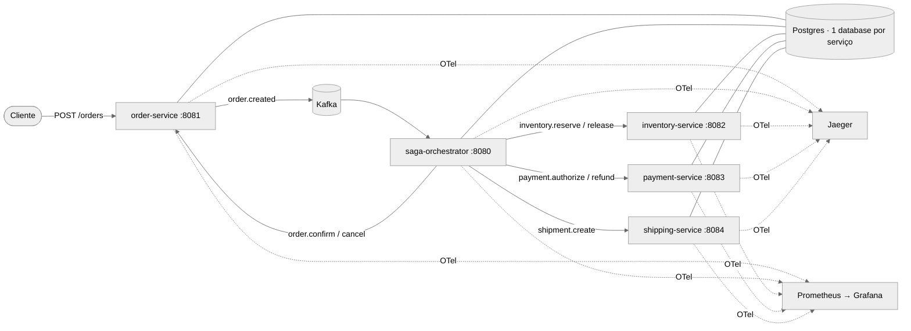

# Checkout Saga · Squad Agêntica

Checkout distribuído (Pedido, Estoque, Pagamento, Envio) coordenado por uma **Saga orquestrada**, construído de forma
autônoma por uma **squad de agentes de IA** (Claude Code) com gates de qualidade, memória compartilhada e intervenção
humana opcional, tudo auditável no painel **Squad Control**.

**Autor:** Julien Crouzillard, Software Engineer · Desafio técnico Itaú · 23/09/2026

> Desafio original: [`docs/desafio.md`](docs/desafio.md) · Roteiro da apresentação: [`docs/apresentacao.md`](docs/apresentacao.md)

## Sumário
1. [Visão geral](#1-visão-geral)
2. [Arquitetura](#2-arquitetura)
3. [Como executar](#3-como-executar)
4. [Como testar e reproduzir as falhas](#4-como-testar-e-reproduzir-as-falhas)
5. [Observabilidade](#5-observabilidade)
6. [Como a squad agêntica opera](#6-como-a-squad-agêntica-opera)
7. [Evidências](#7-evidências)
8. [Estrutura do repositório](#8-estrutura-do-repositório)

## 1. Visão geral



| Requisito | Onde |
|---|---|
| Fluxo e compensações | [`docs/architecture/saga.md`](docs/architecture/saga.md) |
| Contratos de eventos (6 eventos obrigatórios + comandos) | [`docs/contracts/events.md`](docs/contracts/events.md) |
| APIs, injeção de falhas e seeds | [`docs/contracts/api.md`](docs/contracts/api.md) |
| Idempotência, retries, timeouts, recuperação, rastreabilidade | [`docs/architecture/README.md` §4](docs/architecture/README.md) |
| Decisões (ADRs) | [`docs/adr/`](docs/adr/) |
| Pergunta: de um container para totalmente distribuído | [`docs/architecture/README.md` §6](docs/architecture/README.md) |
| Rastreabilidade requisito → teste | [`tests/TRACEABILITY.md`](tests/TRACEABILITY.md) |

## 2. Arquitetura
As três visões exigidas (negócio, técnica e agêntica) estão em [`docs/architecture/README.md`](docs/architecture/README.md).
Resumo das decisões:

- **Saga orquestrada** (ADR-001): o fluxo inteiro fica visível e testável num único lugar, e as compensações
  ficam explícitas na máquina de estados.
- **Outbox transacional** (ADR-002): estado e evento são gravados na mesma transação; um relay publica no Kafka.
- **Database por serviço** (ADR-003) e **Kafka** com chave `orderId`, o que preserva a ordem por pedido (ADR-004).
- **Idempotência e retries** (ADR-005): `processed_messages` + retry com o **mesmo** `messageId`; participantes
  republicam a resposta anterior ao receber um comando duplicado.
- **Timeouts** persistidos (`deadline_at`) e varridos por um scheduler: sobrevivem ao reinício do coordenador.

## 3. Como executar
Pré-requisitos: Docker (com Compose v2) e ~6 GB de memória para o Docker.

```bash
docker compose up -d --build     # ou: make up
docker compose ps                 # aguarde todos "healthy"
```

| Componente | URL |
|---|---|
| Pedidos (order-service) | http://localhost:8081/orders |
| Saga (diagnóstico) | http://localhost:8080/sagas/{sagaId} |
| Jaeger (traces) | http://localhost:16686 |
| Grafana (dashboard "Checkout Saga") | http://localhost:3000 (porta configurável: `GRAFANA_PORT=3001` no `.env`) |
| Prometheus | http://localhost:9090 |
| **Squad Control** (painel da squad) | `make squad` → http://localhost:7070 |

Pedido de exemplo:
```bash
curl -s -X POST localhost:8081/orders \
  -H 'Content-Type: application/json' -H "Idempotency-Key: $(uuidgen)" \
  -d '{"customerId":"c-1","deliveryType":"PHYSICAL",
       "items":[{"sku":"SKU-BOOK-001","quantity":1,"unitPrice":49.90}],
       "shippingAddress":{"street":"Av. Paulista","number":"1000","city":"São Paulo","state":"SP","zipCode":"01310-100","country":"BR"}}'
curl -s localhost:8081/orders/<orderId>
```

## 4. Como testar e reproduzir as falhas
```bash
make test                          # testes unitários (mvn test)
make e2e                           # 7 cenários ponta a ponta contra o compose
bash tests/e2e/run.sh payment_failure   # um cenário específico
```
Falhas são injetadas pelo objeto `simulate` no `POST /orders` (ver [`docs/contracts/api.md`](docs/contracts/api.md)).
Cada cenário, com o `curl` equivalente e o resultado esperado, está em [`tests/e2e/scenarios.md`](tests/e2e/scenarios.md).

| Cenário | Como reproduzir | Continuidade / compensações |
|---|---|---|
| Falha no pagamento | `"simulate":{"payment":"DECLINE"}` | libera estoque → cancela pedido |
| Falha no envio | `"simulate":{"shipping":"FAIL"}` | estorna pagamento → libera estoque → cancela pedido |
| Timeout em etapa | `"simulate":{"payment":"TIMEOUT"}` | retries com o mesmo `messageId` → compensação (estorno idempotente) |
| Reinício do coordenador | `"simulate":{"payment":"SLOW"}` + `make kill-orchestrator` | estado e deadlines no banco; o scheduler retoma de onde parou |

Detalhes e diagramas de sequência: [`docs/architecture/saga.md` §4-5](docs/architecture/saga.md).

## 5. Observabilidade
- **Traces**: OpenTelemetry Java Agent em todos os serviços; `traceparent` persistido no outbox, de modo que o trace
  atravessa HTTP → banco → Kafka → orquestrador → participantes num único trace no Jaeger.
- **Métricas de negócio**: `saga_started_total`, `saga_completed_total{outcome}`, `saga_compensations_total{step}`,
  `saga_timeouts_total{step}`, `saga_step_duration_seconds`, `saga_in_flight`.
- **Logs** JSON com `trace_id`, `orderId` e `sagaId`.
- Guia de investigação por cenário: [`docs/observability.md`](docs/observability.md).

## 6. Como a squad agêntica opera
A squad foi construída com **Claude Code**. A sessão principal é o **Orquestrador**; cada especialista é um subagente
com definição versionada em [`.claude/agents/`](.claude/agents/).

| Agente | Papel | Definição |
|---|---|---|
| Orquestrador | delega, coordena, consolida e controla o fluxo | [`docs/squad/orquestrador.md`](docs/squad/orquestrador.md) |
| Arquiteto | bounded contexts, Saga, eventos, ADRs | [`.claude/agents/arquiteto.md`](.claude/agents/arquiteto.md) |
| Backend | serviços, APIs, mensageria, persistência | [`.claude/agents/backend.md`](.claude/agents/backend.md) |
| DevOps | Dockerfile, compose, CI | [`.claude/agents/devops.md`](.claude/agents/devops.md) |
| Observabilidade | logs, traces, métricas, dashboards | [`.claude/agents/observabilidade.md`](.claude/agents/observabilidade.md) |
| QA | testes unitários, e2e e de falha | [`.claude/agents/qa.md`](.claude/agents/qa.md) |
| **Jev** (agente extra) | gatekeeper independente: avalia cada passagem com evidências e confiança | [`.claude/agents/jev.md`](.claude/agents/jev.md) |

**Estrutura dos agentes.** Cada definição traz prompt, objetivo, responsabilidades, entradas, saídas, ferramentas,
regras de decisão e interação com os demais. As regras comuns ficam em [`CLAUDE.md`](CLAUDE.md), a constituição
carregada por todos.

**Comunicação.** Nunca é direta entre agentes: segue o padrão *blackboard*, em que o Orquestrador delega e os agentes
leem e escrevem artefatos no repositório. Por isso o protocolo **independe de fornecedor**: Copilot Coding Agent ou
Devin podem ocupar qualquer papel, desde que leiam e escrevam os mesmos arquivos.

**Passagem de contexto.** Ocorre por briefs de handoff em
[`docs/squad/memory/handoffs/`](docs/squad/memory/handoffs/) e pelo prompt de delegação, que inclui objetivo,
entradas, saídas, critérios de gate e limites.

**Conhecimento compartilhado (memory layer).**
- Longo prazo: ADRs e contratos.
- Episódico: [`decisions.jsonl`](docs/squad/memory/decisions.jsonl), um log append-only de tarefas, decisões,
  handoffs, gates e intervenções humanas.

**Conflitos.**
- *Prevenção*: propriedade single-writer por diretório e contrato antes do código.
- *Detecção*: o Jev compara código × contrato.
- *Resolução*: hierarquia de verdade (desafio > ADR/contrato > código); o Orquestrador arbitra e o humano desempata
  quando há risco de negócio.

**Gates e autonomia.**
- G1, G2 e G3 são definidos em [`docs/squad/gates.md`](docs/squad/gates.md).
- O Jev emite um parecer com **confiança** e **evidências**.
- A intervenção humana passa a ser **obrigatória** quando a confiança fica abaixo de 70%, o risco é alto ou é o 3º
  ciclo de devolução.
- Autocorreção: um `RETURN` gera nova delegação com as instruções do parecer.

**Squad Control** (`make squad` → http://localhost:7070): linha do tempo das fases, recomendação do Jev com
confiança, evidências, botões de intervenção humana (gravados no log) e o **feed ao vivo de cada agente**, lido das
transcrições das sessões do Claude Code.

## 7. Evidências
- Log de execução da squad: [`docs/squad/memory/decisions.jsonl`](docs/squad/memory/decisions.jsonl)
- Pareceres do Jev: [`docs/squad/gates/`](docs/squad/gates/)
- Handoffs entre agentes: [`docs/squad/memory/handoffs/`](docs/squad/memory/handoffs/)
- Relatório do último e2e: [`tests/e2e/last-report.json`](tests/e2e/last-report.json) — **7/7** (1ª execução integrada 6/7 → defeito → autocorreção → 7/7; ver [`tests/TRACEABILITY.md`](tests/TRACEABILITY.md))
- Board da squad no GitHub: issues por agente + Project (kanban) espelhando o log (`make github-sync`)
- Histórico git: cada fase é um commit do Orquestrador

## 8. Estrutura do repositório
```
.claude/agents/        definições dos agentes (prompt, ferramentas, regras)
CLAUDE.md              constituição da squad (regras comuns, ownership, autonomia)
docs/                  desafio, arquitetura, contratos, ADRs, observabilidade, squad (memória, gates)
services/              common + saga-orchestrator + order/inventory/payment/shipping-service
infra/                 postgres (init), observability (prometheus, grafana)
tests/                 e2e, rastreabilidade
tools/squad/           log da memória compartilhada + servidor do Squad Control
squad-control/         painel web da squad
```

## 9. Limitações conhecidas e evolução
Todas vêm dos riscos em aberto dos pareceres do Jev (`docs/squad/gates/`):
- **Uma réplica do orquestrador**: o `group.instance.id` é fixo (`saga-orchestrator-1`, sobrescrevível via
  `KAFKA_GROUP_INSTANCE_ID`). Com N réplicas, cada uma precisa de um id próprio (ex.: nome do pod de um StatefulSet).
- **Cobertura e2e de timeout**: há cenário próprio só para o pagamento. Timeout de estoque/envio e `TIMEOUT_ONCE`
  usam o mesmo mecanismo e têm testes unitários, mas não têm cenário e2e dedicado.
- **Ordem do outbox** garantida com 1 instância por serviço; para escalar o relay: particionamento por `orderId`
  ou CDC (Debezium).
- Limpeza de `outbox`/`processed_messages`, DLQ com reprocessamento e schema registry ficam como evolução
  (ver a resposta da seção 12 em [`docs/architecture/README.md`](docs/architecture/README.md) §6).
