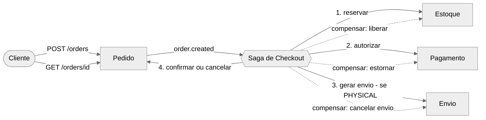
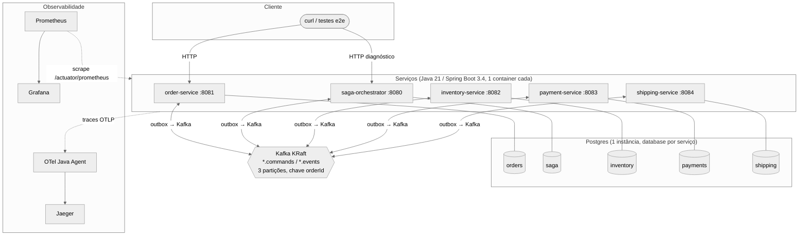
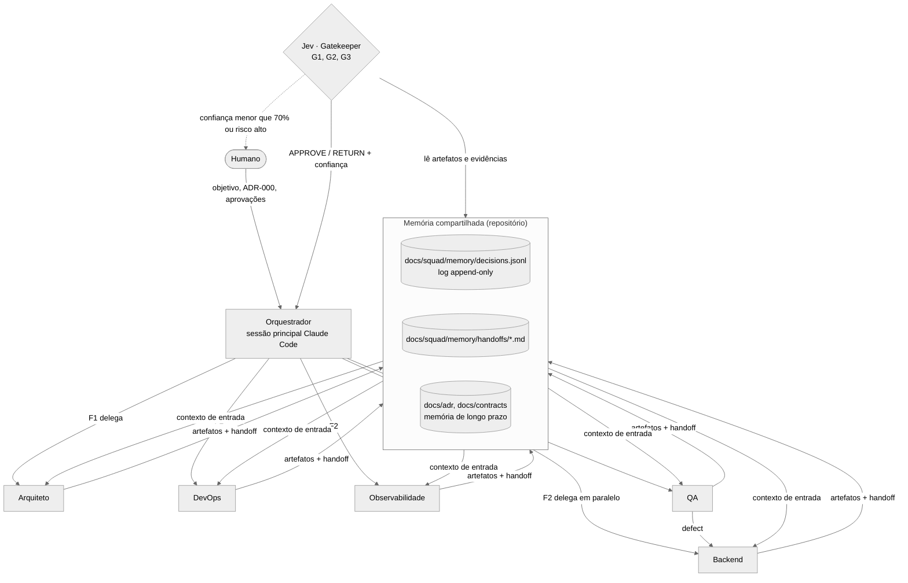

# Arquitetura — Checkout Saga

Documentos: [Saga (estados, sequências, falhas)](saga.md) · [Contrato de eventos](../contracts/events.md) ·
[Contrato de APIs](../contracts/api.md) · [ADRs](../adr/) · [Observabilidade](../observability.md).

## 1. Visão de negócio

Bounded contexts (seção 10 do desafio: Pedido, Estoque, Pagamento, Envio e Saga):

| Contexto | Responsabilidade | Agregado / dados próprios | Operações (seção 4) |
|----------|------------------|---------------------------|---------------------|
| **Pedido** (`order-service`) | Receber o pedido, expor status ao cliente, confirmar/cancelar | `Order` (`PENDING → CONFIRMED \| CANCELED`), histórico | `POST /orders`, `GET /orders/{orderId}`, `order.confirm/cancel` |
| **Estoque** (`inventory-service`) | Reservar e liberar itens (tudo-ou-nada) | `Stock`, `Reservation` | `reserve`, `release` |
| **Pagamento** (`payment-service`) | Autorizar e estornar | `Payment` | `authorize`, `refund` |
| **Envio** (`shipping-service`) | Solicitar entrega (só pedidos `PHYSICAL`) e cancelá-la | `Shipment` | `create` (solicitar entrega), `cancel` |
| **Saga** (`saga-orchestrator`) | Coordenar o processo, decidir desfecho e compensações | `SagaInstance` | — (processo de negócio) |

Regras de negócio: pedido `DIGITAL` não gera envio; qualquer falha após a reserva desfaz o que foi feito em ordem
reversa; o cliente sempre enxerga um estado terminal (`CONFIRMED`/`CANCELED` com motivo).

## 2. Visão técnica

- **APIs**: HTTP/JSON apenas na borda (`order-service`) e para diagnóstico/consulta (`api.md`). Entre serviços,
  somente mensagens assíncronas (comandos e eventos) — nenhum acoplamento síncrono.
- **Persistência**: database por serviço (ADR-003), migrações Flyway; cada serviço tem `outbox` e `processed_messages`.
- **Broker**: Kafka (ADR-004); padrão tópico de comandos + tópico de eventos por contexto (`events.md` §1).
- **Containers**: 5 serviços + Postgres + Kafka + Jaeger + Prometheus + Grafana; `docker compose up --build`.
- **Observabilidade**: traces W3C propagados HTTP → outbox → Kafka; métricas de negócio da saga; logs JSON com
  `trace_id`, `orderId`, `sagaId`.

## 3. Visão agêntica

A solução é construída por uma squad de agentes Claude Code (subagentes em `.claude/agents/`), coordenada pelo
Orquestrador (`docs/squad/orquestrador.md`) sob as regras de `CLAUDE.md`.

| Elemento | Como funciona |
|----------|---------------|
| **Agentes** | Arquiteto, Backend, DevOps, Observabilidade, QA (exigidos) + **Jev** (gatekeeper de qualidade, agente extra justificado por governança). Cada um tem prompt, responsabilidades, entradas/saídas e regras de decisão em `.claude/agents/<nome>.md`. |
| **Delegação** | Orquestrador → agente via ferramenta `Agent` com tarefa estruturada (objetivo, entradas, saídas, critérios do gate, limites). Fases F1 → F2 (paralela) → F3 → F4. |
| **Comunicação / contexto** | Nunca direta: padrão *blackboard* — artefatos + handoff (≤ 40 linhas) + evento no log (`tools/squad/log.py`). Independe de fornecedor (Copilot Coding Agent / Devin leem os mesmos arquivos). |
| **Memória** | Episódica: `decisions.jsonl`; de passagem: `handoffs/`; de longo prazo: ADRs e contratos. |
| **Ferramentas** | Claude Code (Read/Write/Edit/Bash/Agent), Maven, Docker Compose, Kafka/Postgres, OpenTelemetry, `tools/squad/log.py`. |
| **Conflitos** | Prevenção por *single-writer* por diretório e contrato-antes-de-código; detecção pelo Jev (código × contrato) e QA (`defect`); resolução pela hierarquia de verdade (desafio > ADR/contrato > código), Orquestrador arbitra, humano desempata risco de negócio. |
| **Limites de autonomia** | Sem `git push`, sem credenciais, sem escrita fora do próprio diretório; mudança de contrato só via ADR; gate com confiança < 70 % ou risco alto → humano obrigatório; máx. 2 ciclos de autocorreção por gate. |

## 4. Requisitos não funcionais → mecanismo

| Requisito (seção 6) | Mecanismo | Onde |
|---------------------|-----------|------|
| **Idempotência** | `Idempotency-Key` no `POST /orders`; `processed_messages` por consumidor; `UNIQUE(order_id)` nos participantes; re-publicação da resposta em comando duplicado; tombstone de compensação | `api.md` §1, `events.md` §5, ADR-005 |
| **Retries** | Scheduler reenvia comando com o **mesmo `messageId`** e backoff exponencial; limitado em ações, infinito em compensações; relay do outbox repete publicação até sucesso | `saga.md` §3.2–3.3 |
| **Timeouts** | Deadline por passo persistido (`deadline_at`) + varredura periódica; esgotado → compensação | `saga.md` §3.2, §5.1 |
| **Recuperação após falhas** | Estado da saga em Postgres; offset confirmado após commit; outbox; retomada no startup; DLT para mensagens venenosas | `saga.md` §3.5, §4.5 |
| **Rastreabilidade ponta a ponta** | W3C `traceparent` HTTP → outbox → header Kafka → consumidor; `correlationId`/`causationId` no envelope; `saga_step_log`; histórico em `GET /orders/{id}`; logs JSON com `trace_id` | `events.md` §2, `saga.md` §3.6 |
| **Publicação de eventos** | Outbox transacional + relay por polling (at-least-once, ordem por `orderId`) | ADR-002 |

## 5. Escolha monólito × serviços (seção 11)
Optamos por **múltiplos serviços** (5 containers) em vez de monólito modular: o desafio avalia arquitetura
distribuída, falhas parciais e reinício do coordenador — cenários que só são reais com processos, bancos e
rede separados. O custo (mais containers) é mitigado pela lib `common` (envelope, outbox, idempotência).

## 6. Pergunta arquitetural (seção 12): de um container para arquitetura totalmente distribuída

Nossa solução **já nasce distribuída** (cada componente em seu container). Abaixo, o que já está feito e o que
faltaria para produção — que é o mesmo caminho que um monólito em um container precisaria percorrer.

| Tema | Já feito | Falta para produção |
|------|----------|---------------------|
| **Banco de dados** | Database por serviço (ADR-003), sem joins entre contextos; consistência via Saga; migrações Flyway por serviço | Instâncias Postgres **separadas** por serviço (ou gerenciadas, ex.: RDS), réplicas de leitura, backup/PITR, pool de conexões (PgBouncer), segredos em Vault/Secrets Manager |
| **Descoberta de serviços** | DNS do Docker Compose (`kafka:9092`, `postgres:5432`) | DNS de Service do **Kubernetes** (ou Consul); config via ConfigMap/Secret; *readiness/liveness probes* já expostas pelo Actuator |
| **Comunicação síncrona** | Só na borda (`POST/GET /orders`) e consultas | **API Gateway** (auth, rate limit, TLS); *service mesh* (Istio/Linkerd) com mTLS, timeouts e retries declarativos; **circuit breaker** (Resilience4j) em qualquer chamada síncrona futura |
| **Comunicação assíncrona** | Kafka com chave `orderId`, outbox, consumidores idempotentes, DLT | Cluster **multi-broker, RF=3, `min.insync.replicas=2`**; **Schema Registry** (Avro/JSON Schema) com compatibilidade versionada; ACLs/TLS; reprocessamento de DLT com ferramenta operacional; CDC (Debezium) no lugar do relay por polling |
| **Observabilidade** | OTel agent → Jaeger; Micrometer → Prometheus → Grafana; logs JSON com `trace_id` | **OTel Collector** central com amostragem por cauda; backend durável (Tempo/Jaeger+ES); logs centralizados (Loki/ELK); **SLOs e alertas** (saga presa, lag, `COMPENSATION_STUCK`) |
| **Escalabilidade** | Serviços stateless; 3 partições permitem até 3 consumidores por grupo; scheduler com `SKIP LOCKED` suporta N réplicas do orquestrador | **HPA por lag de consumo** (KEDA) e CPU; mais partições conforme volume; particionar/arquivar tabelas `outbox`/`processed_messages` com limpeza por TTL |
| **Resiliência** | Timeouts, retries, compensações, retomada após reinício, healthchecks | Múltiplas réplicas por zona, *PodDisruptionBudget*, bulkheads, circuit breakers, testes de caos, *runbook* para sagas presas, backpressure e limites de retry com alerta |
