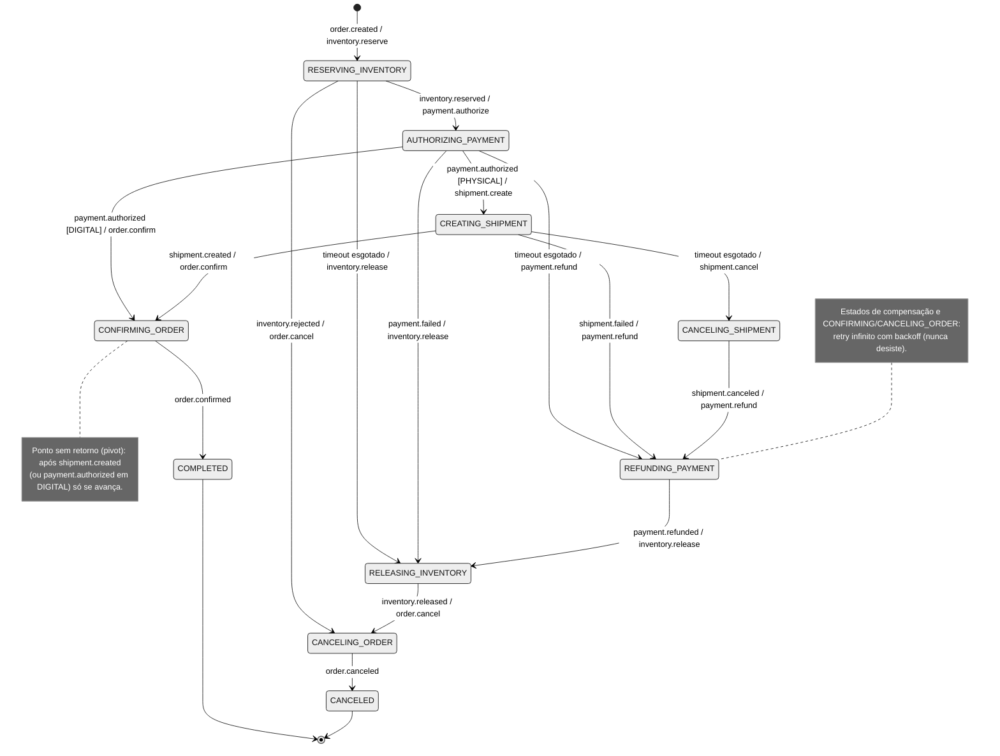
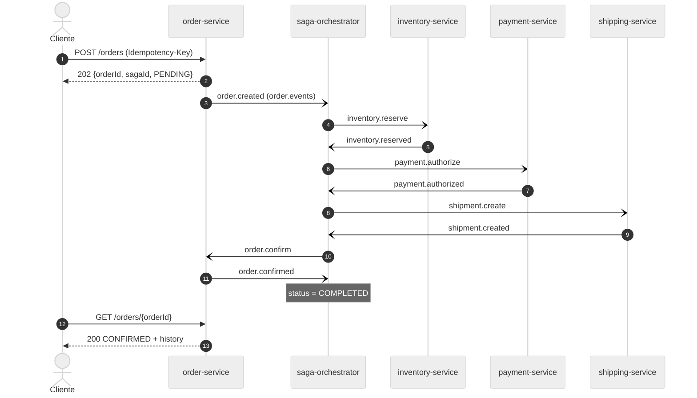
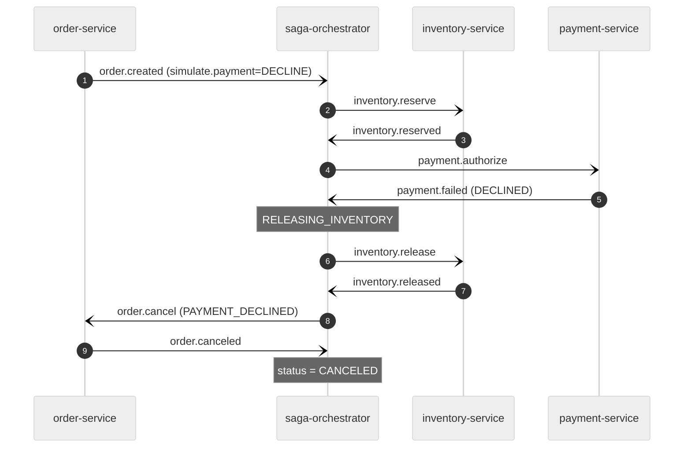
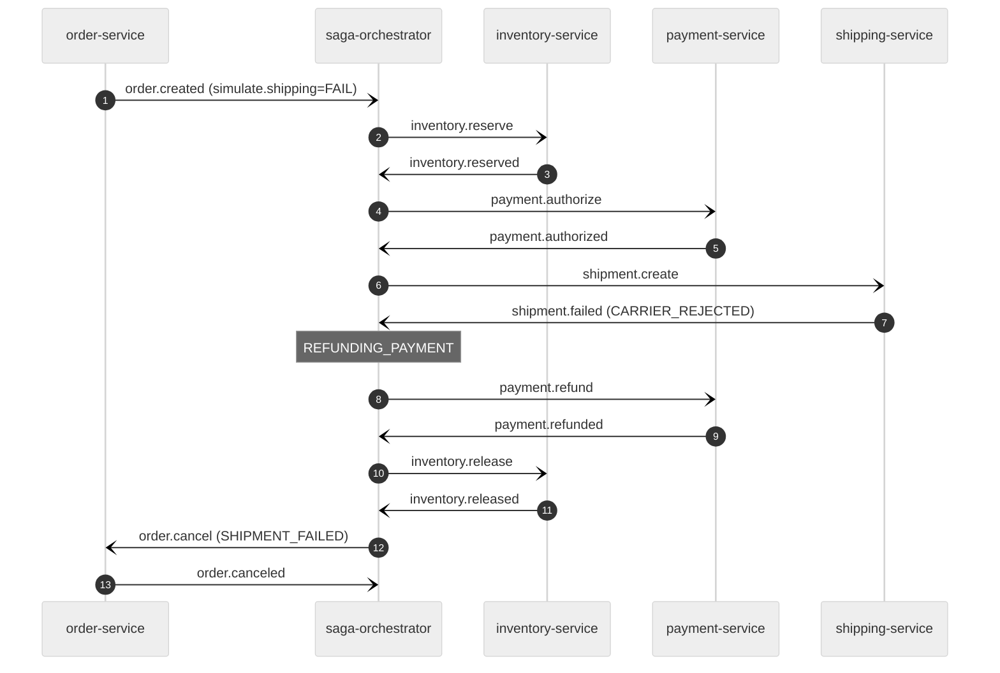

# Saga de Checkout (orquestrada)

> Contratos: [`events.md`](../contracts/events.md) · [`api.md`](../contracts/api.md) · Decisão: [ADR-001](../adr/001-saga-orquestrada.md).
> Métricas da saga (`saga_started_total`, `saga_completed_total{outcome}`, `saga_compensations_total{step}`,
> `saga_step_duration_seconds`, `saga_timeouts_total{step}`): definidas em [`docs/observability.md`](../observability.md).

## 1. Máquina de estados

Estado persistido em `saga_instance.status`. Terminais: `COMPLETED` (pedido confirmado) e `CANCELED`.
Toda transição é **uma transação**: atualiza `saga_instance` + grava `saga_step_log` + grava no outbox o próximo
comando e o `saga.step-changed` + registra `processed_messages` da mensagem recebida.



Estados de **ação**: `RESERVING_INVENTORY`, `AUTHORIZING_PAYMENT`, `CREATING_SHIPMENT` (retries limitados).
Estados de **compensação/finalização**: `CANCELING_SHIPMENT`, `REFUNDING_PAYMENT`, `RELEASING_INVENTORY`,
`CANCELING_ORDER`, `CONFIRMING_ORDER` (retry infinito). Compensações rodam **em ordem reversa**, uma por vez.

## 2. Tabela de passos

| # | Passo (`step`) | Comando | Sucesso | Falha de negócio | Compensação do passo | Timeout / retries |
|---|----------------|---------|---------|------------------|----------------------|-------------------|
| 1 | `INVENTORY` | `inventory.reserve` | `inventory.reserved` | `inventory.rejected` → nada reservado (tudo-ou-nada) → `order.cancel` | `inventory.release` → `inventory.released` | `SAGA_STEP_TIMEOUT_MS`, até `SAGA_STEP_MAX_RETRIES` com o mesmo `messageId`; esgotado → `inventory.release` (reserva pode ter ocorrido) |
| 2 | `PAYMENT` | `payment.authorize` | `payment.authorized` | `payment.failed` → `inventory.release` → `order.cancel` | `payment.refund` → `payment.refunded` | idem; esgotado → `payment.refund` → `inventory.release` → `order.cancel` |
| 3 | `SHIPPING` (só `PHYSICAL`) | `shipment.create` | `shipment.created` | `shipment.failed` → `payment.refund` → `inventory.release` → `order.cancel` | `shipment.cancel` → `shipment.canceled` (só em timeout) | idem; esgotado → `shipment.cancel` → `payment.refund` → `inventory.release` → `order.cancel` |
| 4 | `ORDER` | `order.confirm` / `order.cancel` | `order.confirmed` / `order.canceled` | — (operação local, sempre possível) | — (pivot) | retry infinito, backoff exponencial até `SAGA_COMPENSATION_BACKOFF_MAX_MS` |

`order.canceled.reason`: `OUT_OF_STOCK`/`UNKNOWN_SKU` (passo 1), `PAYMENT_DECLINED` (2), `SHIPMENT_FAILED` (3),
`STEP_TIMEOUT` (qualquer passo com retries esgotados).

## 3. Mecanismos que o Backend deve implementar

### 3.1 Persistência (database `saga`)
```
saga_instance(
  saga_id uuid PK, order_id uuid UNIQUE NOT NULL, status varchar(32) NOT NULL,
  current_step varchar(16), delivery_type varchar(16) NOT NULL,
  order_snapshot jsonb NOT NULL,          -- customerId, items, totalAmount, currency, shippingAddress, simulate
  payment_id uuid, shipment_id uuid, tracking_code varchar(64),
  last_command_id uuid,                   -- messageId do comando em voo (reutilizado nos retries)
  last_command_type varchar(40),
  last_causation_id uuid,                 -- messageId que causou o comando em voo
  attempt int NOT NULL DEFAULT 0,
  deadline_at timestamptz,                -- prazo da resposta do comando em voo
  next_retry_at timestamptz,              -- quando reenviar (backoff)
  step_started_at timestamptz,            -- início do passo (saga_step_duration_seconds)
  failure_reason varchar(32), failed_step varchar(16), failure_message text,
  correlation_id uuid, trace_parent varchar(64),
  version bigint NOT NULL DEFAULT 0,      -- lock otimista
  created_at timestamptz, updated_at timestamptz)
INDEX (deadline_at) WHERE status NOT IN ('COMPLETED','CANCELED')
INDEX (next_retry_at) WHERE status NOT IN ('COMPLETED','CANCELED')

saga_step_log(id bigserial PK, saga_id uuid, step varchar(16), action varchar(32),
  -- COMMAND_SENT | REPLY_RECEIVED | TIMEOUT | RETRY | COMPENSATION_STARTED | IGNORED_LATE_REPLY | COMPENSATION_STUCK
  -- | RESUMED_AFTER_RESTART (carência pós-reinício, §3.5; ADR-013)
  message_type varchar(40), message_id uuid, attempt int, detail text, created_at timestamptz)
```
Comuns a **todos** os serviços (lib `common`):
```
outbox(id bigserial PK, message_id uuid NOT NULL, topic varchar(64), message_key varchar(64),
  type varchar(40), payload jsonb NOT NULL /* envelope completo */, trace_parent varchar(64),
  created_at timestamptz, published_at timestamptz NULL, publish_attempts int DEFAULT 0)
  -- message_id NÃO é único: um retry de comando grava nova linha com o MESMO message_id
processed_messages(message_id uuid, consumer varchar(64), processed_at timestamptz, PRIMARY KEY(message_id, consumer))
```
Domínio (sugestão): `orders`, `order_items`, `order_status_history` (orders);
`stock(sku PK, available, reserved, version)`, `reservations(order_id UNIQUE, reservation_id, status, items jsonb, noop, attempts)` (inventory);
`payments(order_id UNIQUE, payment_id, status, amount, currency, authorization_code, noop, attempts)` (payments);
`shipments(order_id UNIQUE, shipment_id, status, tracking_code, address jsonb, noop, attempts)` (shipping).

### 3.2 Envio de comando, deadline e scheduler de timeouts
1. Ao entrar num estado que envia comando: novo `last_command_id = UUID`, `attempt = 1`,
   `deadline_at = now() + SAGA_STEP_TIMEOUT_MS`, `next_retry_at = null`, linha no outbox — tudo na mesma transação.
2. **Scheduler** (`SagaTimeoutScheduler.scan()`, `@Scheduled(fixedDelayString = SAGA_TIMEOUT_SCAN_INTERVAL_MS)`),
   em **duas fases** (cada saga numa transação própria, para que uma falha não derrube o lote):
   - **Fase 1 — candidatas, sem lock** (`SagaRepository.findDue`, fora de transação):
     `SELECT saga_id, trace_parent FROM saga_instance WHERE status NOT IN terminais AND (deadline_at <= :now OR next_retry_at <= :now) ORDER BY updated_at LIMIT 50`.
   - **Fase 2 — por saga** (`SagaService.tick(sagaId)`, `@Transactional`, dentro do trace restaurado por
     `TraceContext.runWith(trace_parent)`): `SagaRepository.lockDue` refaz o filtro de vencimento com
     `SELECT ... WHERE saga_id = :id AND <não terminal> AND (deadline_at <= :now OR next_retry_at <= :now) FOR UPDATE SKIP LOCKED`.
     Se a linha está travada (resposta sendo processada, outra réplica) ou já não está vencida → nada a fazer
     (a candidata é descartada neste ciclo). Senão aplica `SagaStateMachine.onTick` e grava com
     `SagaRepository.update`: `UPDATE ... SET version = version + 1 WHERE saga_id = :id AND version = :version`
     (**lock otimista**; 0 linhas → `OptimisticLockingFailureException` → rollback, a saga volta no próximo ciclo).
   - Respostas dos participantes usam o lock **bloqueante** `SagaRepository.lockById` (`FOR UPDATE`, sem SKIP):
     resposta e scheduler nunca aplicam transições concorrentes na mesma saga; a que chega depois vê o estado novo.
   - Em `onTick`, `next_retry_at` vencido tem precedência sobre `deadline_at` (os dois nunca estão preenchidos juntos).
   - `deadline_at` vencido → log `TIMEOUT`, `saga.step-changed(TIMED_OUT)`; `saga_timeouts_total{step}` só para
     os passos de participante (`INVENTORY`, `PAYMENT`, `SHIPPING`; não para `ORDER`).
     - Estado de **ação** e `attempt <= SAGA_STEP_MAX_RETRIES` → `next_retry_at = now() + SAGA_RETRY_BACKOFF_MS × 2^(attempt-1)`, `deadline_at = null`.
     - Estado de ação com retries esgotados → `failure_reason = STEP_TIMEOUT` e transição de compensação (tabela §2).
     - Estado de compensação/finalização → `next_retry_at = now() + min(backoff × 2^(attempt-1), SAGA_COMPENSATION_BACKOFF_MAX_MS)`;
       se `attempt >= SAGA_COMPENSATION_ALERT_AFTER` → log ERROR `COMPENSATION_STUCK` (alerta).
   - `next_retry_at` vencido → reenviar **o mesmo comando com o mesmo `messageId`** (nova linha no outbox), `attempt++`,
     novo `deadline_at`, `next_retry_at = null`, log `RETRY`.
3. **Resposta recebida**: aceita só se `causationId == last_command_id` e o `type` é esperado no estado; zera
   `deadline_at`/`next_retry_at` e transiciona. Caso contrário → `IGNORED_LATE_REPLY` (sem transição).

### 3.3 Outbox transacional + relay (ADR-002)
- Handler/controller grava efeito + outbox numa transação. Relay: `@Scheduled(fixedDelay = OUTBOX_POLL_INTERVAL_MS)`,
  `SELECT ... WHERE published_at IS NULL ORDER BY id LIMIT OUTBOX_BATCH_SIZE FOR UPDATE SKIP LOCKED`, `send(...).get()`
  com header `traceparent` da linha, marca `published_at`. Falha de envio → mantém pendente (retry no próximo ciclo).
- Entrega **at-least-once**; ordem por `orderId` preservada (relay único, `ORDER BY id`, mesma chave → mesma partição).

### 3.4 Consumo idempotente
Listener transacional: `processed_messages` + efeito + outbox numa transação; **ack do offset após o commit**
(`enable.auto.commit=false`, AckMode `RECORD`). Duplicata → apenas ack (participante re-publica resposta, `events.md` §5).

### 3.5 Retomada no startup (com carência — [ADR-013](../adr/013-carencia-de-prazos-na-retomada.md))
Nenhum estado em memória. Ao subir: (a) consumidor retoma do último offset confirmado (static membership:
`group.instance.id`, sem esperar o `session.timeout.ms` do membro morto); (b) relay publica outbox pendente;
(c) `SagaTimeoutScheduler.logRecovery()` (`ApplicationReadyEvent`) registra quantas sagas não terminais existem;
(d) **carência**: o **primeiro** ciclo do scheduler, antes de qualquer `findDue`, chama
`SagaService.resumeAfterRestart(SAGA_STEP_TIMEOUT_MS)` (uma única transação):
- `SagaRepository.lockResumable(now + SAGA_STEP_TIMEOUT_MS)`:
  `SELECT ... WHERE <não terminal> AND deadline_at IS NOT NULL AND deadline_at < :t ORDER BY created_at FOR UPDATE SKIP LOCKED`
  — isto é, toda saga com comando em voo cujo prazo **venceu na queda ou venceria antes de um prazo completo**;
- para cada uma, `SagaStateMachine.resumeAfterRestart`: `deadline_at = now + SAGA_STEP_TIMEOUT_MS`, **sem**
  incrementar `attempt`, **sem** reenviar comando e sem `saga.step-changed`; grava `saga_step_log`
  `RESUMED_AFTER_RESTART` (detalhe `deadline <antigo> -> <novo> (tentativa mantida)`) e incrementa `saga_resumed_total`
  após o commit;
- sagas aguardando retry (`next_retry_at` preenchido, `deadline_at` nulo) e terminais **não** mudam: o retry
  pendente sai normalmente no ciclo seguinte;
- se a carência falhar (banco indisponível), o flag `resumed` continua falso e ela é tentada de novo no próximo
  ciclo — nenhum timeout é cobrado antes dela.

Motivo: o tempo em que o **coordenador** esteve fora não é culpa do participante; a resposta pode estar no Kafka
esperando o consumidor voltar. Sem a carência, uma queda maior que o prazo consumia tentativas (ou esgotava os
retries e compensava) de sagas saudáveis — era o defeito do reinício do coordenador corrigido no G3 inicial.

Réplicas: `FOR UPDATE SKIP LOCKED` (scheduler e carência) + `version` (lock otimista) + partições tornam a varredura
segura com N instâncias. Limitações conhecidas (ADR-013): cada réplica que **sobe** re-arma a carência também das
sagas das demais (atrasa a detecção de timeout em até um prazo, uma vez por startup) e o `group.instance.id` padrão
é fixo (`saga-orchestrator-1`): com mais de uma réplica, cada uma precisa do seu `KAFKA_GROUP_INSTANCE_ID`.

### 3.6 Rastreabilidade
`traceparent` do `POST /orders` → outbox → header Kafka → spans de consumo (agente OTel) → comandos seguintes.
O scheduler (sem contexto ativo) **restaura** o contexto a partir de `saga_instance.trace_parent` ao reenviar/compensar,
para que retries e compensações fiquem no mesmo trace. MDC com `orderId`, `sagaId`, `messageId` em todo log.

### 3.7 Contagem de tentativas do `simulate` (`TIMEOUT` / `TIMEOUT_ONCE`) nos participantes
Contrato: [`events.md` §3](../contracts/events.md). Implementação (idêntica em inventory/payment/shipping):
- A contagem é do **participante**, independente de `saga_instance.attempt`: coluna `attempts` da linha de domínio
  (`reservations`, `payments`, `shipments`, `UNIQUE(order_id)`), incrementada por
  `<Repo>.incrementAttempts(orderId)` (`UPDATE ... SET attempts = attempts + 1 ... RETURNING attempts`) na mesma
  transação do handler, **a cada recebimento do comando de ação** para o pedido — o primeiro, os retries do
  orquestrador (mesmo `messageId`, já em `processed_messages`) e eventuais reentregas do Kafka.
- A decisão é `ReplyPolicy.shouldReply(mode, attempts)`: `TIMEOUT` → nunca responde; `TIMEOUT_ONCE` →
  responde se `attempts >= 2` (silêncio só no 1º recebimento); demais → responde.
- A ação executa **uma** vez (linha de domínio já existe → re-publica a resposta a partir do estado); só a
  resposta é suprimida. Se o pedido já foi compensado (tombstone), responde `ALREADY_COMPENSATED` sem contar.
- Consequência: com `TIMEOUT_ONCE`, o orquestrador vê `TIMEOUT` na tentativa 1 e `REPLY_RECEIVED` na tentativa 2
  (histórico `PAYMENT TIMED_OUT (1)` → `RETRYING (2)` → `SUCCEEDED (2)`). Uma reentrega do Kafka da 1ª tentativa
  (queda entre commit e ack) também conta e pode antecipar a resposta — sem efeito funcional (idempotente).
- Valores aceitos (`Simulate.ALLOWED`, 400 no `POST /orders` para outros): `TIMEOUT_ONCE` só em `payment` e `shipping`.

## 4. Diagramas de sequência

### 4.1 Caminho feliz (PHYSICAL)

Em `DIGITAL`, após `payment.authorized` o orquestrador envia direto `order.confirm` (sem `shipment.*`).

### 4.2 Falha no pagamento


### 4.3 Falha no envio


### 4.4 Timeout em uma etapa (pagamento, `simulate.payment=TIMEOUT`)
```mermaid
%%{init: {'theme':'neutral'}}%%
sequenceDiagram
    autonumber
    participant S as saga-orchestrator
    participant T as scheduler (saga)
    participant I as inventory-service
    participant P as payment-service
    participant O as order-service
    S-)I: inventory.reserve
    I-)S: inventory.reserved
    S-)P: payment.authorize (messageId=M1, tentativa 1)
    Note over P: autoriza e NÃO responde
    T->>S: deadline vencido → TIMED_OUT, backoff
    S-)P: payment.authorize (messageId=M1, tentativa 2)
    Note over P: duplicata detectada; continua sem responder
    T->>S: deadline vencido (tentativa 3 idem)
    Note over S: retries esgotados → REFUNDING_PAYMENT (STEP_TIMEOUT)
    S-)P: payment.refund
    P-)S: payment.refunded (noop=false: autorização real estornada)
    S-)I: inventory.release
    I-)S: inventory.released
    S-)O: order.cancel (STEP_TIMEOUT)
    O-)S: order.canceled
```
Com `TIMEOUT_ONCE`, a tentativa 2 recebe resposta e a saga segue normalmente (retry bem-sucedido); a contagem
é do participante (`attempts` na linha de domínio, §3.7).
Tempo até a compensação com os defaults: 5 s (t1) + 1 s de backoff + 5 s (t2) + 2 s + 5 s (t3) ≈ 18 s.

### 4.5 Reinício do coordenador
```mermaid
%%{init: {'theme':'neutral'}}%%
sequenceDiagram
    autonumber
    participant S as saga-orchestrator
    participant DB as Postgres (saga)
    participant K as Kafka
    participant P as payment-service
    S->>DB: TX: status=AUTHORIZING_PAYMENT + outbox(payment.authorize)
    S-)K: relay publica payment.authorize
    Note over S: container morto (docker compose kill)
    K-)P: payment.authorize
    P-)K: payment.authorized (fica no tópico; offset do grupo não avançou)
    Note over S: container reinicia
    S->>DB: 1º ciclo do scheduler: carência (§3.5) → deadline_at = now + timeout,<br/>RESUMED_AFTER_RESTART, tentativa mantida, sem reenvio
    S->>DB: relay: publica outbox pendente (se houver)
    K-)S: consumo retoma do último offset confirmado → payment.authorized
    S->>DB: TX: dedupe + transição → CREATING_SHIPMENT + outbox(shipment.create)
    Note over S: se a resposta não vier dentro do novo prazo → TIMEOUT/retry normais (§3.2)
    Note over S: saga continua até COMPLETED
```

## 5. Cenários de falha obrigatórios

| Cenário | Mecanismo de continuidade | Compensações executadas | Como reproduzir |
|---------|---------------------------|-------------------------|-----------------|
| **Falha no pagamento** | `payment.failed` é resposta de negócio (não há retry); orquestrador transiciona para compensação. | `inventory.release` → `order.cancel` (`PAYMENT_DECLINED`). Nenhum refund (nada autorizado). | `POST /orders` com `"simulate": {"payment": "DECLINE"}` → pedido `CANCELED`; `GET /inventory/reservations/{id}` = `RELEASED`; estoque volta. |
| **Falha no envio** | `shipment.failed` (não há retry: recusa de negócio). | `payment.refund` → `inventory.release` → `order.cancel` (`SHIPMENT_FAILED`). | `"simulate": {"shipping": "FAIL"}`, `deliveryType=PHYSICAL` → `CANCELED`; pagamento `REFUNDED`; reserva `RELEASED`. |
| **Timeout em qualquer etapa** | Deadline persistido + scheduler; retry com mesmo `messageId` (participantes idempotentes re-publicam a resposta); esgotado → compensação. | Compensa o próprio passo (pode ter sido executado tardiamente) + anteriores: inventário → `release`; pagamento → `refund` + `release`; envio → `shipment.cancel` + `refund` + `release`; depois `order.cancel` (`STEP_TIMEOUT`). | `"simulate": {"payment": "TIMEOUT"}` (ou `inventory`/`shipping`: `TIMEOUT`) → `CANCELED` em ≈ 3×5 s + backoff. `"payment": "TIMEOUT_ONCE"` → `CONFIRMED` após 1 retry. |
| **Reinício do coordenador** | Estado 100% em Postgres; offset só confirmado após commit; outbox pendente republicado; carência no startup re-arma os prazos vencidos na queda sem consumir tentativa (§3.5, ADR-013); depois o scheduler segue normal. | Nenhuma extra — a saga **continua** de onde parou (ou compensa, se o participante não responder dentro do novo prazo e os retries se esgotarem). | (a) `docker compose stop saga-orchestrator`, `POST /orders`, `docker compose start saga-orchestrator` → `CONFIRMED`. (b) `"simulate": {"payment": "SLOW"}`, `docker compose kill saga-orchestrator` durante o atraso, `start` → `CONFIRMED`. |

### 5.1 A ambiguidade do timeout
Timeout **não significa falha**: o participante pode ter executado e a resposta atrasou/perdeu-se. Por isso:
- o retry usa o **mesmo `messageId`** — o participante não executa duas vezes, apenas re-publica o resultado;
- ao esgotar os retries, a compensação é enviada **também para o passo que expirou** (`refund`, `release`,
  `shipment.cancel`). Se a ação ocorreu, é desfeita; se não ocorreu, a compensação é **no-op registrado**
  (`noop=true` + *tombstone*), e uma ação que chegue depois responde `ALREADY_COMPENSATED` sem efeito;
- como comando e compensação têm a mesma chave (`orderId`), chegam **em ordem** na mesma partição;
- respostas tardias ao orquestrador são ignoradas (`IGNORED_LATE_REPLY`) — a compensação já cobre o efeito.

### 5.2 O que acontece quando dá erro na solicitação de entrega (seção 4 do desafio)
- **Erro de negócio** (transportadora recusa, endereço inválido) → `shipment.failed`: não adianta repetir; o
  orquestrador estorna o pagamento, libera o estoque e cancela o pedido com `SHIPMENT_FAILED`. O cliente vê
  `CANCELED` + motivo em `GET /orders/{orderId}`; nenhum valor fica retido.
- **Erro técnico/transitório** (serviço de envio fora do ar, sem resposta) → tratado como timeout: retries com o
  mesmo `messageId`; se o serviço voltar a tempo, a saga segue sem o cliente perceber. Esgotados os retries,
  `shipment.cancel` (caso o envio tenha sido criado tardiamente) + `refund` + `release` + `order.cancel (STEP_TIMEOUT)`.
- Mensagens retidas enquanto o shipping-service está fora ficam no Kafka e são processadas quando ele volta.
- Alternativa **não adotada** (decisão de negócio futura): manter o pedido "pago, aguardando envio" e reprocessar
  manualmente; rejeitada por reter o valor do cliente sem prazo.

### 5.2.1 Resultado esperado de `TIMEOUT` em estoque e envio (confirmação D6, sem mudança de contrato)
- `simulate.inventory=TIMEOUT`: reserva real, sem resposta → após os retries, `inventory.release` (`noop=false`) →
  `order.cancel (STEP_TIMEOUT)`. Histórico: `INVENTORY TIMED_OUT` → `INVENTORY COMPENSATED` → `ORDER CANCELED`.
  Nenhum pagamento nem envio é criado.
- `simulate.shipping=TIMEOUT`: envio real, sem resposta → `shipment.cancel` → `payment.refund` → `inventory.release`
  → `order.cancel (STEP_TIMEOUT)`. Histórico: `SHIPPING TIMED_OUT` → `SHIPPING COMPENSATED` → `PAYMENT COMPENSATED`
  → `INVENTORY COMPENSATED` → `ORDER CANCELED`; shipment `CANCELED`, payment `REFUNDED`, reserva `RELEASED`.
- Verificação automatizada: `docs/architecture/testes.md` §4.

### 5.3 Falha de compensação
Compensações e `order.confirm/cancel` **nunca desistem**: retry infinito com backoff exponencial limitado a
`SAGA_COMPENSATION_BACKOFF_MAX_MS`; a partir de `SAGA_COMPENSATION_ALERT_AFTER` tentativas, log ERROR
`COMPENSATION_STUCK` (alerta no Grafana) e a saga permanece visível em `GET /sagas/{sagaId}` para intervenção.
Compensações são idempotentes e comutativas com a ação (tombstone), então repetir é sempre seguro.
