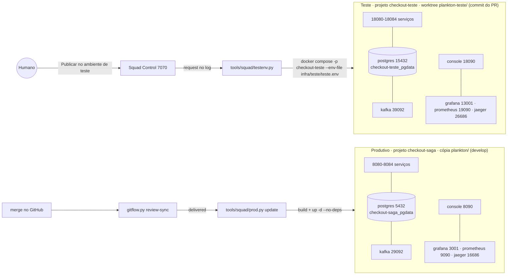
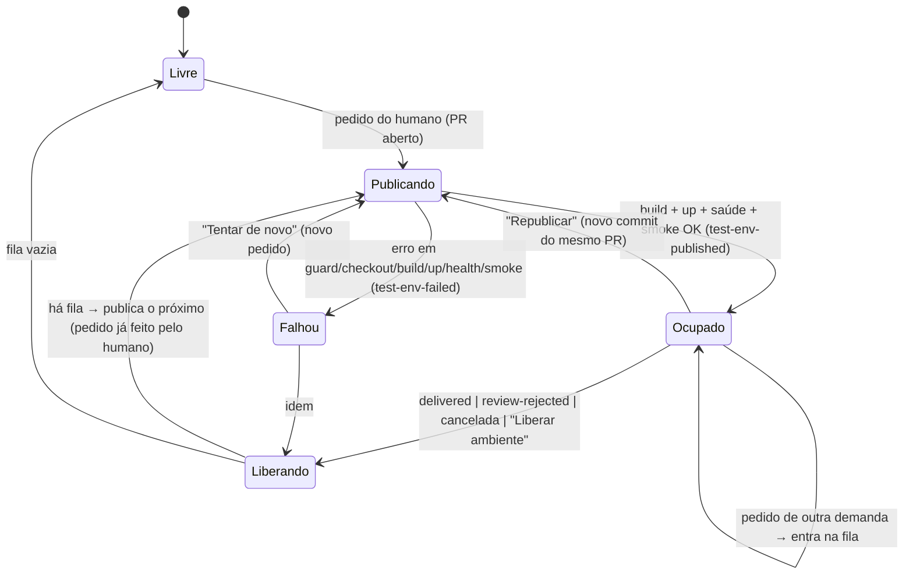

# Contrato — Ambiente de teste compartilhado e atualização do produtivo local (D15, `518f89f27ae8`, tipo operação)

> Decisão: [ADR-018](../adr/018-ambiente-de-teste-compartilhado.md). Complementa a entrega por PR
> ([`entrega-por-pr.md`](entrega-por-pr.md), ADR-011) — tudo aqui é **aditivo** a ela.
> Implementação por dono: **DevOps** (`docker-compose.yml`, `infra/teste/**`, `Makefile`), **Orquestrador**
> (`tools/squad/**`, `AGENTS.md`, `docs/squad/**`), **Frontend** (`squad-control/**`), **QA** (`tests/**`).
> Respostas do humano (`docs/squad/inbox/done/518f89f27ae8.json`):
> (1) **um** ambiente de teste compartilhado, ocupado pela demanda em revisão; as outras ficam **na fila** até o PR em
> teste ser aprovado; publicar é **escolha do humano**, na página da demanda; (2) o **produtivo** é a stack atual
> (projeto `checkout-saga`) e o de teste sobe em **outras portas — regra forte**; (3) o humano pede a publicação; a
> atualização do produtivo após o merge fica com a **develop**; (4) **isolamento total** (Kafka, Postgres,
> observabilidade); produtivo **inalterado e inquebrável**; dados do teste **persistem** (o humano apaga se quiser);
> (5) **Pronto para testar** = PR aberto **e** publicado no teste; **Entregue** = merge na develop.

## 1. Definições

| Termo | Definição |
|---|---|
| **Produtivo (local)** | Projeto Compose `checkout-saga`, rodando a partir da cópia principal (`plankton/`, branch `develop`) com o `.env` dela (`GRAFANA_PORT=3001`). Portas 5432, 29092, 4317-4318, 16686, 9090, 3001, 8080-8084, 8090. Volume `checkout-saga_pgdata`. |
| **Teste** | Projeto Compose **`checkout-teste`**, rodando a partir de um worktree dedicado (`plankton-teste/`) fixado no commit *head* do PR. Portas = produtivo **+ 10 000**. Volume `checkout-teste_pgdata`, rede `checkout-teste_default`, imagens `checkout-teste/<svc>:local`. |
| **Ocupante** | A demanda publicada no teste naquele momento (no máximo uma). |
| **Fila do teste** | Pedidos de publicação do humano esperando o ambiente ficar livre (FIFO pela hora do pedido). |
| **Pronto para testar** | PR da demanda aberto **e** publicação concluída com saúde OK no teste (evento `test-env-published` sem `test-env-released` posterior). |
| **Entregue** | Merge do PR na `develop` (evento `delivered`, sem mudança em relação à D8). |

Nome do projeto: `checkout-teste` e **não** `checkout-saga-teste`, porque qualquer filtro por prefixo
(`docker ps --filter name=checkout-saga`, `grep checkout-saga`) casaria os dois ambientes. Toda verificação de
isolamento usa o rótulo exato `com.docker.compose.project=<projeto>`.

## 2. Arquitetura

### 2.1 Mesmo `docker-compose.yml`, parametrizado (DevOps)
Um único arquivo; nada de override com `ports` (listas de portas **se somam** no merge de arquivos do Compose e o
produtivo ficaria com as portas duplicadas). Toda porta publicada e todo nome de imagem viram variável **com default
igual ao valor atual**:

| Serviço | Variável | Produtivo (default) | Teste (`infra/teste/teste.env`) |
|---|---|---|---|
| saga-orchestrator | `SAGA_PORT` | 8080 | **18080** |
| order-service | `ORDER_PORT` | 8081 | **18081** |
| inventory-service | `INVENTORY_PORT` | 8082 | **18082** |
| payment-service | `PAYMENT_PORT` | 8083 | **18083** |
| shipping-service | `SHIPPING_PORT` | 8084 | **18084** |
| checkout-console | `CONSOLE_PORT` (já existe) | 8090 | **18090** |
| postgres | `POSTGRES_PORT` | 5432 | **15432** |
| kafka (externo) | `KAFKA_EXTERNAL_PORT` | 29092 | **39092** |
| jaeger UI | `JAEGER_UI_PORT` | 16686 | **26686** |
| jaeger OTLP gRPC/HTTP | `OTLP_GRPC_PORT` / `OTLP_HTTP_PORT` | 4317 / 4318 | **14317 / 14318** |
| prometheus | `PROMETHEUS_PORT` | 9090 | **19090** |
| grafana | `GRAFANA_PORT` (já existe) | 3000 (3001 pelo `.env`) | **13001** |
| imagens | `IMAGE_NAMESPACE` | `checkout-saga` | **`checkout-teste`** |

Regras de forma:
- Só o **lado do host** muda: `"${ORDER_PORT:-8081}:8081"`. Portas internas, `SERVER_PORT`, URLs internas
  (`kafka:9092`, `jaeger:4318`, `postgres:5432`), `prometheus.yml` e `nginx.conf` **não mudam** (resolvem por nome na
  rede do próprio projeto).
- Kafka: `"${KAFKA_EXTERNAL_PORT:-29092}:29092"` e `EXTERNAL://localhost:${KAFKA_EXTERNAL_PORT:-29092}` no
  `KAFKA_ADVERTISED_LISTENERS` (senão um cliente do host no teste seria redirecionado ao Kafka produtivo).
- Imagens: `image: ${IMAGE_NAMESPACE:-checkout-saga}/<svc>:local`. **Obrigatório**: hoje o teste reescreveria a tag
  `checkout-saga/<svc>:local` e o próximo `docker compose up -d` do produtivo recriaria os containers com o código do PR.
- `name: checkout-saga` permanece no arquivo; o teste sempre passa `-p checkout-teste` (o `-p` tem precedência).
- **Regra forte de portas** (validada por `testenv.py` antes de qualquer `up`, ver §4.1 passo 3): porta do teste =
  porta do produtivo + 10 000; nenhuma porta do teste pertence ao conjunto do produtivo
  `{5432, 29092, 4317, 4318, 16686, 9090, 3000, 3001, 8080-8084, 8090}`, nem a `3000` (outro projeto local), nem a
  `7070` (Squad Control); todas ficam em `13001–39092`.

### 2.2 `infra/teste/teste.env` (DevOps, versionado, sem segredos)
Contém apenas `COMPOSE_PROJECT_NAME=checkout-teste`, `IMAGE_NAMESPACE=checkout-teste` e as portas da tabela. É passado
com `--env-file`, então o `.env` da cópia principal **nunca** é lido pelo teste e o `teste.env` **nunca** é lido pelo
produtivo.

### 2.3 Worktree de origem
- `plankton-teste/` é um `git worktree` **dedicado e só da ferramenta** (irmão de `plankton/`; caminho configurável
  em `SQUAD_TEST_WORKTREE`), em **HEAD destacado** no commit `headRefOid` do PR (`gh pr view --json headRefOid`).
- Por que não o worktree da feature: os agentes continuam editando nele, e o console é *bind mount* — o humano
  testaria um alvo móvel. Com o commit fixo, o que foi testado é rastreável (`commit` no evento).
- A ferramenta pode fazer `git checkout --detach --force <sha>` nesse worktree (ninguém edita ali); nunca faz
  `git stash`, nunca toca `plankton/` nem os worktrees das features.

### 2.4 Recursos
Teste e produtivo juntos ≈ 2 × (5 × 512 MB + infra). Antes do `up`, `testenv.py` compara a memória do Docker
(`docker info` `MemTotal`) com a soma dos `mem_limit` em execução mais os do teste; abaixo de
`SQUAD_TEST_MIN_FREE_GB` (padrão 2) registra **aviso** no `test-env-publishing` (`warning`) e segue — o produtivo
tem prioridade: se o host ficar sem memória, o humano derruba o teste (§4.5), nunca o produtivo.

## 3. Estados

### 3.1 Estado do ambiente de teste (derivado do log + `docker compose -p checkout-teste ps`)
| Estado | Condição | Mostra |
|---|---|---|
| `livre` | sem ocupante (nunca publicado, ou último `test-env-released`) | "Ambiente de teste livre" |
| `publicando` | `test-env-publishing` sem `test-env-published`/`test-env-failed` posterior | demanda, commit, fase atual, início |
| `ocupado` | `test-env-published` sem `test-env-released` posterior | "Em teste: Dn · PR #N · commit abc123" + URLs; **desatualizado** se `headRefOid` do PR ≠ commit publicado |
| `falhou` | último desfecho da demanda à frente é `test-env-failed` | fase, detalhe, ação "Tentar de novo" / "Apagar dados do teste" |
| `divergente` | log diz `ocupado` mas os containers do projeto não estão saudáveis | aviso A5 (§6); ação "Republicar" |

Um lock (`docs/squad/memory/.test-env.lock`, fora do git) garante **uma** operação por vez (publicar, liberar,
apagar dados).

### 3.2 Estágio da demanda (acréscimo ao `stage_of` / stepper do ADR-016)
`… → Gates → Revisão (PR) → Pronto para testar → Entregue`. O passo **Pronto para testar** é opcional: se o humano
integrar sem publicar, aparece como "pulado". Rótulos de status (`demandInfo`):

| Status | Condição |
|---|---|
| `Em revisão · PR #N` | PR aberto, sem pedido de publicação (ação: **Publicar no ambiente de teste**) |
| `Na fila do teste · posição K` | pedido pendente, ambiente ocupado por outra demanda (ação: **Sair da fila**) |
| `Publicando no teste` | a demanda é a de `test-env-publishing` corrente |
| `Pronto para testar · PR #N` | ocupante com saúde OK (ações: **Abrir ambiente**, **Republicar** se desatualizado, **Liberar ambiente**) |
| `Falha ao publicar no teste` | último desfecho `test-env-failed` (ações: **Tentar de novo**, **Apagar dados do teste**) |
| `Entregue` | `delivered` (inalterado) |

"Precisa de você" (ADR-016 §4.3) ganha: *Pronto para testar* (testar e revisar o PR) e *Falha ao publicar*.

## 4. Ciclo de vida

### 4.1 Publicar — `testenv.py publish --demand <id>`
Pré-condições (senão `test-env-failed phase=guard`, nada é tocado): existe pedido `test-env-request action=publish`
**do humano** para a demanda ainda não atendido; a demanda tem `review` com PR **aberto** (`gh pr view` state OPEN).
1. `test-env-publishing` (demand, pr, commit).
2. Worktree: cria `plankton-teste/` se não existe; `git fetch origin`; `checkout --detach --force <headRefOid>`.
3. **Guard** sobre `docker compose -p checkout-teste --env-file infra/teste/teste.env config --format json`
   (executado dentro de `plankton-teste/`): `name == "checkout-teste"`; toda `published` port obedece à regra forte
   (§2.1); toda `image` começa com `checkout-teste/`; todo volume nomeado resolve para `checkout-teste_*`;
   nenhuma porta do teste está ocupada por container de **outro** projeto. Qualquer violação → falha sem `up`.
4. `docker compose … build` (timeout 15 min) — falha aqui não derruba o que estava no teste.
5. `docker compose … up -d --wait --wait-timeout 300` (sem `--force-recreate` da infraestrutura; Postgres com dados
   persistidos). **Nunca** `-v`.
6. Smoke: `GET /actuator/health` dos 5 serviços (18080-18084) e `GET /` do console (18090); opcional
   `--e2e happy_path` (ver §7).
7. `test-env-published` (demand, pr, commit, project, ports, urls, durationSec, smoke) → estado `ocupado`.

Falha no Flyway por migração aplicada no banco do teste e ausente no commit publicado (dados de outra demanda) →
`test-env-failed phase=health` com `hint="reset-data"`; a UI oferece **Apagar dados do teste**. Nunca apagamos sozinhos.

### 4.2 Fila e troca de demanda
- Pedido com ambiente `ocupado`/`publicando` por **outra** demanda → entra na fila (sem ação no Docker). Não há
  "furar a fila" nem troca forçada (resposta 1 do humano); o humano pode **Liberar ambiente** e depois publicar.
- Ao liberar (§4.3), `testenv.py reconcile` publica o primeiro da fila **cujo PR ainda está aberto**; pedidos de
  demandas entregues/canceladas/devolvidas saem da fila com `test-env-released reason=obsolete`.
- **Republicar** (mesma demanda, novo commit do PR) não passa pela fila.

### 4.3 Liberar — `testenv.py release --demand <id> --reason <r>`
Gatilhos: `delivered` e `review-rejected` (chamado por `review-sync`), cancelamento (D7), ou o humano ("Liberar
ambiente"). Faz `docker compose -p checkout-teste stop` (**mantém containers e volume**), registra
`test-env-released` e chama `reconcile`. A próxima publicação reaproveita os dados (resposta 4).

### 4.4 Apagar dados do teste (só por pedido do humano) — `testenv.py reset-data`
Exige `test-env-request action=reset-data` do humano com confirmação digitada (`APAGAR`). Executa
`docker compose -p checkout-teste --env-file infra/teste/teste.env down -v` **dentro do worktree de teste**, depois de
repetir o guard (§4.1 passo 3) — o comando é recusado se o projeto resolvido não for `checkout-teste`. Se havia
ocupante, republica o mesmo commit.

### 4.5 Derrubar — `testenv.py down`
Pedido do humano: `down` **sem** `-v` do projeto `checkout-teste` (libera memória, preserva dados).

### 4.6 `reconcile` (idempotente)
Chamado pelo servidor após cada pedido, por `review-sync` e a cada ciclo do plantão. Calcula o estado (§3.1) e, se
`livre` com fila, publica o primeiro. Não faz nada se o lock estiver tomado.

## 5. Quem executa o quê

| Ação | Quem inicia | Por onde | Executa |
|---|---|---|---|
| Publicar / Republicar / Tentar de novo | **Humano** | Squad Control (página da demanda) ou `make teste-publicar DEMAND=<id>` | servidor grava `test-env-request` (agent `humano`) e dispara `testenv.py reconcile` em segundo plano |
| Sair da fila | Humano | Squad Control | `test-env-request action=cancel` |
| Liberar ambiente | Humano; ou automático em `delivered`/`review-rejected`/cancelamento | Squad Control / `make teste-liberar` / `review-sync` | `testenv.py release` |
| Apagar dados do teste | **Somente humano**, com confirmação | Squad Control / `make teste-apagar-dados CONFIRMA=APAGAR` | `testenv.py reset-data` |
| Derrubar | Humano | `make teste-derrubar` | `testenv.py down` |
| Status | qualquer um | `make teste-status`, `GET /api/test-env` | leitura |
| Atualizar o produtivo | automático após `delivered`; manual pelo humano | `review-sync` / `make prod-atualizar` | `prod.py update` (§8) |

- **Nenhum agente publica sem pedido do humano**: `testenv.py publish` recusa sem `test-env-request` de
  `agent=humano` pendente. `make teste-publicar` executado no terminal pelo humano grava esse pedido.
- Nenhum agente roda `docker compose` sem `-p` explícito (acréscimo a `AGENTS.md` › Limites de autonomia, pelo
  Orquestrador): o produtivo só é alterado por `prod.py`, o teste só por `testenv.py`.
- Makefile (DevOps): `teste-publicar`, `teste-status`, `teste-liberar`, `teste-derrubar`, `teste-apagar-dados`,
  `e2e-teste`, `prod-atualizar`, todos delegando a `tools/squad/`. **Recomendação** (fora dos CAs): `make down`
  (hoje `down -v` do produtivo) passar a exigir `CONFIRMA=sim`.

### 5.1 API (servidor, aditiva)
- `GET /api/test-env` → `{state, demand, pr, commit, prHead, stale, phase, publishedAt, urls:{console, grafana,
  jaeger, prometheus, saga, order, inventory, payment, shipping}, queue:[{demand, pr, requestedAt, position}],
  lastError:{phase, detail, hint}}`. O mesmo objeto entra em `/api/state` e (resumido: `state, demand, stale,
  queueSize`) em `/api/live`, dentro do orçamento do ADR-017.
- `POST /api/test-env/request` `{demand, action: publish|cancel|release|reset-data|down, confirm?}` → `202`
  `{state, position?}`; `409` se `publish` sem PR aberto, `400` se `reset-data` sem `confirm:"APAGAR"`. Idempotente:
  pedido repetido de quem já está na fila/ocupando devolve o estado atual (publish do ocupante com PR à frente =
  republicar).

### 5.2 UI (Frontend, `squad-control/**`)
- **Página da demanda** (`#/demandas/<Dn>`), bloco "Ambiente de teste": botão **Publicar no ambiente de teste**
  visível só com PR aberto; estados e ações da §3.2; links das URLs do teste; commit publicado vs. head do PR.
- **Painel**: cartão "Ambiente de teste" — `Livre` ou `Em teste: Dn · PR #N` (+ `Publicando…` / `Falhou`) e a fila.
- Estado sempre com ícone + palavra + cor (ADR-017 item 5). Nada de `confirm()`: a confirmação do "Apagar dados" é
  um campo onde se digita `APAGAR`.

## 6. Eventos novos no log (só acréscimo)

| `type` | `agent` | Campos |
|---|---|---|
| `test-env-request` | `humano` | `demand`, `action` (`publish`/`cancel`/`release`/`reset-data`/`down`), `pr` |
| `test-env-publishing` | `orquestrador` | `demand`, `pr`, `commit` |
| `test-env-published` | `orquestrador` | `demand`, `pr`, `commit`, `project`, `ports`, `urls`, `durationSec`, `smoke` |
| `test-env-failed` | `orquestrador` | `demand`, `pr`, `commit`, `phase` (`guard`/`checkout`/`build`/`up`/`health`/`smoke`), `detail` (≤ 1500), `hint?` |
| `test-env-released` | `orquestrador` | `demand`, `reason` (`delivered`/`review-rejected`/`canceled`/`human`/`obsolete`), `next?` |
| `test-env-reset` | `orquestrador` | `requestedBy` (id do `test-env-request`) |
| `prod-updated` | `orquestrador` | `commit`, `from`, `services[]`, `durationSec`, `delivered` (id do evento) |
| `prod-update-failed` | `orquestrador` | `commit`, `from`, `services[]`, `phase` (`guard`/`build`/`up`/`health`), `rolledBack` (bool), `detail` |

Alertas (ADR-017, calculados no servidor): **B5** `prod-update-failed` sem `prod-updated` posterior (owner humano);
**A4** `test-env-failed` do ocupante/da cabeça da fila; **A5** ambiente `divergente`. Os tipos novos entram na lista de
"eventos humanos/de ciclo" que não contam como progresso de agente.

## 7. e2e contra o ambiente de teste (QA)
- `make e2e-teste` = `ORDER_URL=http://localhost:18081 SAGA_URL=…:18080 INVENTORY_URL=…:18082 PAYMENT_URL=…:18083
  SHIPPING_URL=…:18084 JAEGER_URL=…:26686 E2E_COMPOSE_PROJECT=checkout-teste bash tests/e2e/run.sh`.
- `tests/e2e/run.sh`: o cenário de reinício (hoje `docker compose kill/up saga-orchestrator`, que sem `-p` atinge o
  **produtivo**) passa a usar `docker compose -p "${E2E_COMPOSE_PROJECT:-checkout-saga}"` e é **pulado** quando o
  projeto resolvido é `checkout-saga` fora do CI (`CI` vazio) sem `E2E_ALLOW_PROD=1`.
- A evidência do e2e no teste é registrada com `--evidence e2e-teste=pass|fail` e o commit publicado.

## 8. Atualização do produtivo após o merge — `tools/squad/prod.py update`
Proposta: **automática** ao detectar o merge (logo após `review-sync` registrar `delivered` e sincronizar a develop
local), e também por `make prod-atualizar` (humano). Desligável com `SQUAD_PROD_AUTOUPDATE=0`.

Salvaguardas (todas obrigatórias):
1. **Guard**: roda só na cópia principal, em `develop`, com `HEAD == origin/develop`, sem mudanças rastreadas fora de
   `docs/squad/**`; projeto resolvido `checkout-saga`, `.env` da cópia principal; lock próprio
   (`.prod-update.lock`). Falha → `prod-update-failed phase=guard`, nada tocado.
2. **Diff** entre o último commit implantado (`commit` do último `prod-updated`; na 1ª vez, o rótulo
   `org.opencontainers.image.revision` das imagens ou, sem ele, "todos os serviços de aplicação") e `HEAD`:
   | Caminho alterado | Ação |
   |---|---|
   | `services/<m>/**` | rebuild de `<m>` |
   | `services/common/**`, `pom.xml`, `Dockerfile` | rebuild dos 5 serviços |
   | `checkout-console/index.html` | nada (bind mount já servido após o `pull`) |
   | `checkout-console/nginx.conf` | `restart checkout-console` |
   | `infra/observability/**` | `restart` de `prometheus`/`grafana` conforme o subdiretório |
   | `docker-compose.yml` | `up -d` sem `--build` (o Compose recria só serviços cuja config mudou) |
   | `infra/postgres/init/**` | nada (só vale na 1ª criação do volume) — aviso no evento |
   | resto (`docs/`, `tools/`, `tests/`, `squad-control/`) | nada; registra `prod-updated services=[]` |
3. **Ponto de retorno**: antes do build, `docker tag checkout-saga/<m>:local checkout-saga/<m>:rollback` para cada
   serviço afetado.
4. `docker compose build <m…>` primeiro — build com erro não toca containers.
5. `docker compose up -d --no-deps <m…>` e espera `healthy` (timeout 300 s).
6. **Rollback** se algum não ficar saudável: retag `:rollback → :local` e `up -d --no-deps <m…>`, desde que o diff
   **não** tenha migração Flyway nova (`**/db/migration/**`, `db/common/**`); com migração nova não há rollback
   automático (o banco já pode ter migrado) — `prod-update-failed rolledBack=false` e bloqueio **B5** para o humano.
7. **Nunca**: `down`, `-v`, `--force-recreate` de `postgres`/`kafka`/`jaeger`, `docker volume rm`, `system prune`,
   `--remove-orphans`. Postgres e Kafka só são recriados se a própria definição deles mudar no compose.
8. Resultado vai ao log (`prod-updated` / `prod-update-failed`) e aparece no Painel.

## 9. Critérios de aceite (verificáveis)

**Impressão digital do produtivo** (`testenv.py prod-fingerprint`, JSON ordenado): para cada container com rótulo
`com.docker.compose.project=checkout-saga` — nome, `Id`, `Image` (id), `State.StartedAt`, `RestartCount`, portas
publicadas; `docker volume inspect checkout-saga_pgdata` (`CreatedAt`, `Mountpoint`); ids das imagens
`checkout-saga/*:local`; `docker compose -p checkout-saga config --hash '*'` na cópia principal.

| # | Critério | Como verificar |
|---|---|---|
| CA1 | O `docker-compose.yml` parametrizado não muda o produtivo | na cópia principal, `docker compose config --hash '*'` e `docker compose config` idênticos antes e depois da mudança do DevOps |
| CA2 | Regra forte de portas | `testenv.py check-ports` (e o guard) sobre o `config` do teste: toda porta = produtivo + 10 000, nenhuma em `{5432, 29092, 4317, 4318, 16686, 9090, 3000, 3001, 7070, 8080-8084, 8090}`; teste unitário com `teste.env` adulterado (ex. `ORDER_PORT=8081`, `GRAFANA_PORT=3000`) → recusa sem `up` |
| CA3 | Isolamento total | com o teste no ar: projeto, rede, volume e imagens do teste são `checkout-teste*`; `docker network inspect checkout-teste_default` não contém nenhum container `checkout-saga`; pedido criado em `:18081` não existe em `:8081` e vice-versa; trace do pedido do teste aparece no Jaeger `:26686` e não no `:16686` |
| CA4 | Produtivo intocado por todo o ciclo do teste | `prod-fingerprint` idêntico antes e depois de: publicar, republicar, liberar, apagar dados do teste, derrubar o teste e `make e2e-teste` |
| CA5 | Publicar só por pedido do humano | `testenv.py publish` sem `test-env-request` de `humano` → sai ≠ 0 e grava `test-env-failed phase=guard`; `POST /api/test-env/request action=publish` numa demanda sem PR aberto → `409` |
| CA6 | Pronto para testar | após publicar a demanda com PR aberto: `GET /api/test-env` → `state=ocupado`, `commit == headRefOid`; saúde 200 em 18080-18084 e 18090; página da demanda mostra `Pronto para testar · PR #N` com as URLs; stepper no passo "Pronto para testar" |
| CA7 | Fila | com D-A ocupando, pedido de D-B → `Na fila do teste · posição 1`, nenhum container do teste recriado (`StartedAt` iguais); após `delivered` de D-A, `test-env-released reason=delivered` e publicação automática de D-B |
| CA8 | Pedido obsoleto sai da fila | pedido na fila de demanda cujo PR foi fechado → `test-env-released reason=obsolete`, não publica |
| CA9 | Dados persistem | pedido criado no teste antes de uma republicação continua em `GET :18081/orders/<id>` depois dela |
| CA10 | Apagar dados só com confirmação | `reset-data` sem `confirm:"APAGAR"` → `400`; com confirmação, `checkout-teste_pgdata` tem novo `CreatedAt` e o CA4 continua valendo |
| CA11 | Desatualizado | novo push no PR do ocupante → `stale=true` e ação "Republicar"; republicar não passa pela fila |
| CA12 | Entregue | merge do PR → `delivered` (inalterado), `test-env-released reason=delivered`, status `Entregue` |
| CA13 | Produtivo atualizado só no alterado | merge que muda só `services/order-service/**` → `prod-updated services=["order-service"]`; `StartedAt` de todos os outros containers do `checkout-saga` (incl. postgres/kafka) inalterado; `checkout-saga_pgdata` com o mesmo `CreatedAt`; pedidos anteriores ainda consultáveis em `:8081` |
| CA14 | Merge sem código de serviço não reinicia nada | merge só em `docs/`/`tools/`/`squad-control/` → `prod-updated services=[]` e `prod-fingerprint` idêntico |
| CA15 | Rollback | com uma imagem que não fica saudável (teste com healthcheck forçado a falhar num serviço), `prod-update-failed rolledBack=true` e o serviço volta ao `Image` id anterior, saudável; B5 aparece no Painel |
| CA16 | Nada destrutivo no produtivo | revisão de código + teste: `prod.py` nunca monta comando com `down`, `-v`, `volume rm`, `prune`, `--remove-orphans` ou `--force-recreate` (teste unitário sobre os comandos gerados, com `docker` simulado) |
| CA17 | e2e no teste não toca o produtivo | `make e2e-teste` passa contra o teste (cenário de reinício incluído, no projeto `checkout-teste`) e o CA4 vale; `bash tests/e2e/run.sh` local sem `E2E_ALLOW_PROD=1` pula o reinício do produtivo |
| CA18 | Log só com acréscimos | tipos da §6 aparecem apenas como linhas novas; `/api/state` antigo continua válido (campos novos opcionais) |

## 10. Fora do escopo (v1)
- Mais de um ambiente de teste simultâneo (resposta 1).
- Squad Control da branch em modo teste (porta 17070 com cópia da memória e `SQUAD_READONLY=1`) — útil para demandas
  que mudam `squad-control/**`; fica como evolução, pois exige o servidor saber rodar só-leitura.
- Copiar dados do produtivo para o teste.

## 11. Histórico de alterações
- 2026-09-24 — versão inicial (Arquiteto, D15).
