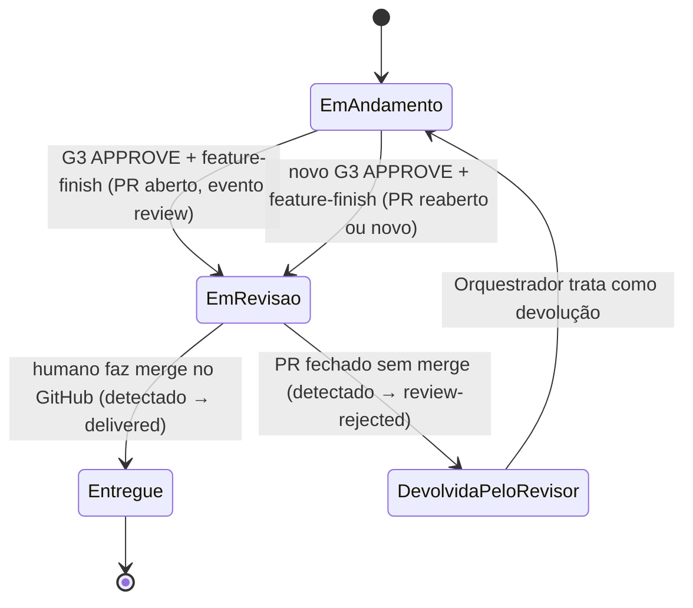

# Contrato — Entrega por PR com revisão humana (D8, `349e5b1bf818`, tipo operação, ADR-011)

> Implementação: **Orquestrador** (`tools/squad/**`, `docs/squad/**`, `AGENTS.md`) e **Frontend** (`squad-control/**`).
> Vale para as **próximas** entregas (toda demanda entregue via Git Flow) e para releases/hotfixes.
> Compatível com a D7 (cancelamento): as mudanças em `server.py`/`github_sync.py`/`index.html` são aditivas.

## 1. Definições (respostas do humano)
- **Pronta** = PR aberto para revisão humana, com o parecer G3 do Auditor no corpo.
- **Entregue** = PR integrado (merge) pelo humano.
- Nada vai para PR sem **G3 APPROVE**; nenhuma ferramenta da squad faz merge; não existe `--force`.

## 2. Fluxo



### 2.1 `gitflow.py feature-finish --demand <id>` (novo comportamento)
1. `--demand` **obrigatório**; sem `G3 APPROVE` mais recente da demanda → sai com erro (sem opção `--force`).
2. `git push -u origin <feature>`; abre o PR para `develop` (ou reaproveita o aberto / reabre o fechado da mesma
   branch com `gh pr reopen`) e atualiza o corpo (`gh pr edit --body`) — idempotente.
3. **Não** chama `gh pr merge`, **não** troca para develop, **não** apaga a branch.
4. Registra `review` (abaixo) — só se ainda não houver `review` aberto para o mesmo PR.

Corpo do PR (Markdown, nesta ordem): título `<código>: <título da demanda>`; **Resumo** (título, descrição, tipo,
prioridade, link `Refs #<issue>`); **Critérios de aceite** (descrição da demanda + perguntas/respostas de
`clarification`); **Parecer do Auditor · G3** (recomendação, confiança %, risco, detalhe, critérios de
`docs/squad/gates/<arquivo>.json`); **Evidências** (eventos `evidence` da demanda: nome = status);
**Artefatos** (refs de contratos/ADRs dos eventos da demanda); **Checklist do revisor humano** (itens: diff coerente
com os critérios; sem mudança de contrato não autorizada; evidências conferidas); rodapé de geração.

### 2.2 Merge — somente pelo humano, **no GitHub**
O painel **não** tem botão de merge nesta versão (ADR-011): mostra "Revisar PR #n no GitHub" (link). Nenhum código da
squad chama `gh pr merge`.

### 2.3 Detecção (sem acordar agente à toa)
- `pending.py`: para cada `review` sem `delivered`/`review-rejected` posterior, consulta
  `gh pr view <url> --json state,mergedAt,mergeCommit,mergedBy,closedAt` e lista **apenas** mudanças:
  `entrega: <demand> PR #n merged` ou `revisão recusada: <demand> PR #n`. PR aberto não gera item. Sem `gh`/rede →
  não lista (aviso em stderr), nunca falso positivo.
- O plantão trata com `gitflow.py review-sync --demand <id>`, que reconsulta o PR e:
  - `MERGED` → registra `delivered`; sincroniza a develop local (`git fetch origin` + `git merge --ff-only origin/develop`
    se a develop estiver em uso e limpa; senão `git fetch origin develop:develop`); apaga a branch local/remota da feature.
  - `CLOSED` sem merge → registra `review-rejected` com os comentários do PR/review (`gh pr view --comments`) no `detail`;
    o Orquestrador trata como **devolução** (task ao dono, correção na mesma branch, nova auditoria G3 — máx. 2 ciclos,
    no 3º escala ao humano) e, com novo G3 APPROVE, `feature-finish` reabre o PR.

### 2.4 Releases e hotfixes
- `release-finish <x.y.z>` / `hotfix-finish <x.y.z>`: push + PR para `main` com CHANGELOG + `review` (`release: x.y.z`), **sem merge**.
- Após o merge humano (detectado por `pending.py` → `release pronta: x.y.z`), `gitflow.py release-publish <x.y.z>`
  (idem `hotfix-publish`): confere `MERGED`, cria a tag `vX.Y.Z` **no merge commit**, GitHub Release, back-merge em
  develop, próxima `-SNAPSHOT` e registra `delivered` (`release: x.y.z`). O back-merge em develop é commit do
  Orquestrador na develop (já previsto no Git Flow); PR fechado sem merge → `review-rejected`, sem tag.

## 3. Eventos novos (autor `orquestrador`)

```json
{ "type": "review", "demand": "<id>", "pr": 42, "url": "https://github.com/.../pull/42",
  "base": "develop", "head": "feature/D8-...", "gate": "<id do evento G3>", "title": "Em revisão · PR #42" }
{ "type": "delivered", "demand": "<id>", "pr": 42, "url": "...", "mergeCommit": "abc1234",
  "mergedBy": "jcrouzillard", "mergedAt": "2026-09-23T18:40:00Z", "title": "Entregue · PR #42 integrado" }
{ "type": "review-rejected", "demand": "<id>", "pr": 42, "url": "...", "closedAt": "...",
  "title": "Devolvida pelo revisor · PR #42", "detail": "<comentários do revisor>" }
```
Releases usam `release: "x.y.z"` no lugar de `demand`. `log.py`: `TYPES` += `review`, `delivered`, `review-rejected`;
args `--pr <n>`, `--url`, `--base`, `--head`, `--merge-commit`, `--merged-by`, `--release`.

## 4. Estados no painel e na issue

| Evento mais recente | Painel (card) | Issue / Project |
|---------------------|---------------|-----------------|
| G3 APPROVE sem `review` | "Aprovada pelo Auditor · abrindo PR" | Status "Em revisão" (**não fecha mais** no G3) |
| `review` | **"Em revisão · PR #n"** + link "Revisar no GitHub" | comentário com link do PR; Status "Em revisão"; label `status:em-revisao` |
| `delivered` | **"Entregue"** (+ merge commit curto, quem integrou) | comentário; Status "Concluído"; issue fechada |
| `review-rejected` | **"Devolvida pelo revisor"** (+ comentários) → depois "Em andamento" | comentário; Status "Em andamento"; issue aberta |

Compatibilidade: demandas com merge anterior à D8 (evento "…integrada em develop via PR") continuam "Concluída".
Cancelamento (D7) tem precedência sobre todos os estados acima; cancelar uma demanda "Em revisão" deve também fechar
o PR (`gh pr close`) — registrar no plantão.

## 5. Mudanças por arquivo e dono

| Dono | Arquivo | Mudança |
|------|---------|---------|
| Orquestrador | `tools/squad/gitflow.py` | §2.1 (sem merge, sem `--force`, `--demand` obrigatório, corpo rico), novo `review-sync`, `release-finish`/`hotfix-finish` sem merge, novos `release-publish`/`hotfix-publish` (§2.4). |
| Orquestrador | `tools/squad/pending.py` | Itens `entrega:`, `revisão recusada:`, `release pronta:` (§2.3). |
| Orquestrador | `tools/squad/log.py` | Tipos e argumentos do §3. |
| Orquestrador | `tools/squad/github_sync.py` | G3 APPROVE não fecha a issue; handlers `review`, `delivered`, `review-rejected` (§4); criar opção "Em revisão" no Project se faltar. |
| Orquestrador | `tools/squad/server.py` | Nenhuma rota nova; `/api/state` já entrega os eventos. (Após o rebase com a D7: cancelar demanda "Em revisão" continua permitido.) |
| Orquestrador | `docs/squad/prompts/plantao.md`, `docs/squad/git-flow.md`, `AGENTS.md` | Plantão trata `entrega:`/`revisão recusada:`/`release pronta:`; tabela do Git Flow com "PR aberto → merge humano"; limite de autonomia: **nenhum agente faz merge em `develop`/`main`**. |
| Frontend | `squad-control/index.html` | Estados/cores do §4 (texto, não só cor), link do PR, merge commit; filtros/contagens que usavam "Concluída" passam a considerar "Entregue". |

## 6. Critérios de aceite

| # | Critério | Verificação |
|---|----------|-------------|
| CA1 | `feature-finish` sem G3 APPROVE falha; não existe `--force`; `--demand` obrigatório. | executar sem gate → código ≠ 0; `--help` |
| CA2 | Com G3 APPROVE, `feature-finish` abre o PR para `develop` **sem merge** e registra **um** `review` (reexecutar não duplica PR nem evento). | PR de teste aberto; log |
| CA3 | Corpo do PR contém as 6 seções do §2.1, incluindo o parecer G3 (recomendação, confiança, risco) e as evidências da demanda. | `gh pr view --json body` |
| CA4 | `grep -rn "pr\", \"merge\\|pr merge" tools/squad` vazio (nenhum merge automático, também em release/hotfix). | grep |
| CA5 | PR fechado sem merge → `pending.py` lista `revisão recusada:`; `review-sync` registra `review-rejected`; painel "Devolvida pelo revisor"; issue volta a "Em andamento". PR aberto não gera item no `pending.py`. | PR de teste fechado |
| CA6 | PR integrado → `delivered` com `mergeCommit`; painel "Entregue"; issue fechada "Concluído"; develop local contém o merge commit; branch da feature removida. | teste com `gh` falso (§7) |
| CA7 | Release: `release-finish` só abre PR para `main`; tag/GitHub Release/back-merge só em `release-publish` após `MERGED`; tag aponta para o merge commit. | teste com `gh` falso |
| CA8 | Sem regressão: demandas antigas "Concluída", D4/D5/D7, controles e gates inalterados; `AGENTS.md`/`git-flow.md` refletem a regra. | smoke do painel + diff dos docs |

## 7. Plano de teste (sem alterar o GitHub real além de um PR descartável)
1. **Testes com `gh` falso** (QA, `tests/squad/test_entrega_por_pr.py`): um executável `gh` em `PATH` temporário
   que registra as chamadas e responde `state` configurável (`OPEN`/`MERGED`/`CLOSED`), com log da squad e repositório
   git temporários (cópia mínima + remote bare local). Cobre CA1, CA2 (idempotência), CA4 (nenhuma chamada `pr merge`
   registrada), CA5, CA6, CA7.
2. **PR real descartável**: branch `feature/D8-teste-pr-descartavel` com um arquivo em `tests/squad/tmp/`, G3 de teste
   registrado com `--detail "teste D8 — descartável"` → `feature-finish` abre o PR (CA2, CA3) → **fechar sem merge** no
   GitHub → `pending.py` + `review-sync` (CA5) → apagar a branch remota. Nada é integrado.
3. **Painel**: estados do §4 com os eventos gerados acima (CA5, CA8). Evidências com `--demand 349e5b1bf818`.
