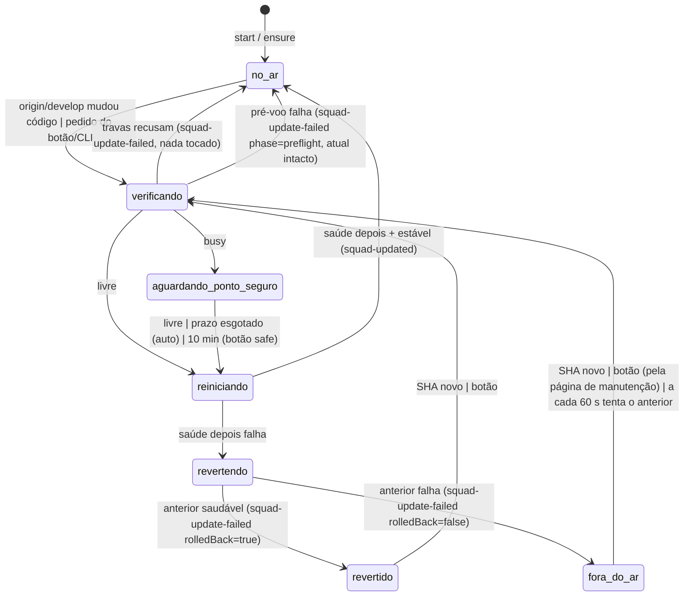

# Contrato: publicação do Squad Control (D24, `cf7a120591b0`, tipo operação)

> Decisão: [ADR-025](../adr/025-publicacao-do-squad-control.md). Aditivo a ADR-018 (travas), ADR-020 (conversa),
> ADR-021 (selo de ambiente e versão) e ADR-024 §3 (`[env.prod] kind = "process"`, `update = "restart"`).
> Nenhum contrato de evento do checkout muda. Os eventos da squad aqui descritos são só acréscimo.

## 0. Donos por arquivo

| Dono | Arquivos | O quê |
|---|---|---|
| Orquestrador | `tools/squad/publisher.py` (novo) | supervisor, CLI, gatilhos, travas, pré-voo, troca, rollback, página de manutenção |
| Orquestrador | `tools/squad/publication.py` (novo) | leitura do `status.json`, gravação de pedidos, visão para a API (importado pelo `server.py`) |
| Orquestrador | `tools/squad/server.py` | 2 rotas, campo `publication` no `/api/live`, `SIGTERM` gracioso (bloco isolado, poucas linhas, ver §11) |
| Orquestrador | `tools/squad/conversa.py` | `Engine.shutdown(reason)` |
| Orquestrador | `tools/squad/instance.py` | `freshness.state = "revertido"` e `build.mode` |
| Orquestrador | `tools/squad/plantao.sh` | `publisher.py ensure` a cada ciclo |
| Orquestrador | `tools/squad/log.py` | os 4 tipos novos em `TYPES` (choices do `--type`), coordenado com a D23 (§8, §11) |
| Orquestrador | `AGENTS.md` | exceção sancionada: o publicador avança a `develop` da cópia principal; agentes não usam `POST /api/squad-control/publish` (§4.2, §5.1) |
| Frontend | `squad-control/index.html` | botão, confirmação, avisos, recarga automática, turno interrompido |
| DevOps (**pedido de mudança**) | `Makefile` | alvos `squad`, `squad-primeiro-plano`, `squad-parar`, `squad-status`, `squad-logs` (§9) |
| QA | `tests/squad/test_publisher.py`, `tests/squad/test_publication_api.py`, `tests/ui/checklist-publicacao-d24.md` | §10 |
| QA | `tests/squad/test_alertas_d14.py:394`, `tests/squad/test_instancia_d18.py:239` (`LIVE_KEYS`) | acrescentar `publication` ao conjunto de chaves do `/api/live` (§4.3, CA-20) |

## 1. Configuração (espelho do `[env.prod]` do ADR-024)
`publisher.py` lê um dicionário `CONFIG` com exatamente estas chaves. Na F2b ele virá do `product.toml` do
`squad-platform`.

| Chave | Valor | Variável que sobrescreve |
|---|---|---|
| `kind` | `"process"` | — |
| `command` | `[sys.executable, "tools/squad/server.py", "--port", "{port}"]` (cwd = raiz da cópia) | `SQUAD_PUBLISH_COMMAND` (só testes) |
| `ports.control` | `7070` | `--port` |
| `health` | `"/api/instance"` | — |
| `update` | `"restart"` | — |
| `watch_paths` | `["tools/squad", "squad-control"]` (= `instance.CODE_PATHS`) | — |
| `poll_s` | 15 (remoto), 2 (pedidos) | `SQUAD_PUBLISH_POLL_S` |
| `safe_wait_s` | 20 (automático), 600 (botão "quando terminar") | `SQUAD_PUBLISH_SAFE_WAIT_S` |
| `health_timeout_s` / `stable_s` / `stop_grace_s` | 20 / 10 / 8 | — |
| `auto` | ligado | `SQUAD_PUBLISH_AUTO=0` desliga só o gatilho (a) |

Diretório de estado: `<cópia principal>/.squad/squad-control/`, que já está no `.gitignore` via `.squad/`. Ele contém
`supervisor.lock`, `supervisor.pid`, `status.json`, `requests/`, `server.log*`, `publisher.log*` e `preflight/`
(temporário).

## 2. CLI `tools/squad/publisher.py`

| Comando | Efeito | Saída / código |
|---|---|---|
| `start [--port 7070]` | daemoniza (`start_new_session`, stdin `/dev/null`), toma o lock e sobe o servidor. Se já houver supervisor, só mostra o estado. Se a porta estiver ocupada por um Squad Control **da cópia principal** (conferido por `/api/instance`: `environment.root` == cópia principal), **adota** só depois de confirmação no terminal (`Encerrar o Squad Control atual (pid N) e subir o supervisionado? [s/N]`; sem TTY ou resposta ≠ `s` → recusa, código 2; `--yes` só para testes): espera o ponto seguro (≤ 20 s), encerra o processo (pid por `lsof -nP -iTCP:<porta> -sTCP:LISTEN -t`; `SIGTERM`, depois `SIGKILL` em 8 s) e sobe o supervisionado. Porta ocupada por outra coisa → recusa. | imprime URL, pid e caminhos de log. 0 ok, 2 recusado |
| `stop` | `SIGTERM` no supervisor, que para o servidor graciosamente (§6) e sai | 0 |
| `status [--json]` | conteúdo de `status.json`, com o pid vivo conferido | 0 no ar; 1 fora |
| `publish [--when now\|safe]` | grava um pedido como o botão (§4.2), mas com `trigger = "cli"` | 0 aceito; 3 sem supervisor |
| `ensure` | se não há supervisor **e** a porta está livre **e** a cópia é a principal, faz `start`. **Nunca adota** e nunca pergunta: a 1ª adoção (servidor atual em primeiro plano, sem supervisor) é só por `make squad` iniciado pelo humano. | 0 |
| `selftest` | importa os módulos, valida `CONFIG` e sai. Usado antes do `execv` (§5.6). | 0 ok |
| `run` | loop em primeiro plano, sem daemonizar (usado por `start` e pelos testes) | — |

**Guarda estrutural**: com `--port 7070` (ou a porta de `CONFIG`), qualquer comando que suba ou derrube um servidor
exige `root == testenv.main_root()` e o branch `develop`. Nos testes o `root` é um repositório temporário, então
**tocar na 7070 real fica impossível por construção** (CA-15).

## 3. Estado ao vivo: `status.json`
Escrito com tmp+`rename` a cada transição. O `server.py` só lê o arquivo, com cache por `mtime`.

```json
{
  "supervised": true,
  "supervisor": {"pid": 4242, "startedAt": "2026-09-25T18:00:00Z", "commit": "a1b2c3d"},
  "server": {"pid": 4250, "port": 7070, "commit": "a1b2c3d4e5f6...", "display": "v1.0.0 · 1.1.0-SNAPSHOT · a1b2c3d",
             "mode": "principal", "root": "/…/plankton", "startedAt": "2026-09-25T18:00:02Z"},
  "state": "no-ar",
  "target": null,
  "trigger": null,
  "deadline": null,
  "busy": null,
  "lastResult": {"type": "squad-updated", "commit": "a1b2c3d", "display": "…", "at": "…", "detail": null, "eventId": "…"},
  "failedCommit": null
}
```

- `mode`: `principal` (código da cópia principal) | `anterior` (worktree `plankton-squad-prev`, revertido) |
  `manutencao` (página estática do supervisor).
- `state`, a máquina do §5:

| `state` | Significado | Texto no painel |
|---|---|---|
| `no-ar` | servidor saudável, nada pendente | — |
| `verificando` | travas e pré-voo do alvo | "Preparando a versão <sha7>…" |
| `aguardando-ponto-seguro` | alvo aprovado no pré-voo, há resposta em andamento; `deadline` preenchido | "Squad Control será atualizado para <sha7> em N s. A resposta em andamento será interrompida." (automático, com contagem) · "Publicação aguardando a resposta terminar" (botão `safe`) |
| `reiniciando` | parando o atual e subindo o novo | não é visto (servidor fora); a tela mostra "Reconectando…" |
| `revertindo` | subindo o anterior depois de uma falha | idem |
| `revertido` | no ar o commit anterior; `failedCommit` preenchido | "Publicação de <sha7> falhou (<fase>); mantida a versão anterior <display>." |
| `fora-do-ar` | novo e anterior falharam; página de manutenção na porta | página de manutenção (§7.4) |

## 4. API do servidor (rotas novas; nenhuma rota existente muda de forma)

### 4.1 `GET /api/squad-control/publication`
`_local_ok` é obrigatório (senão 403 `origem_invalida`). Devolve `200`:
```json
{"supervised": true, "state": "no-ar", "server": {…}, "target": null, "deadline": null, "trigger": null,
 "busy": null, "lastResult": {…}, "failedCommit": null,
 "canPublish": true, "reason": null}
```
- `supervised = false` quando não há `status.json`, quando o pid do supervisor está morto ou quando o servidor não foi
  iniciado por ele (variável `SQUAD_SUPERVISED` ausente). Nesse caso: `canPublish = false`,
  `reason = "sem_supervisor"`.
- `canPublish = false` também com `reason` = `nao_produtivo` (`instance.environment.name != "produtivo"`) ou
  `publicacao_em_andamento` (`state` ∈ `verificando`, `aguardando-ponto-seguro`, `reiniciando`, `revertindo`).
- `busy` = `Engine.busy()` **do próprio servidor** (`{"conversa", "turn"}` ou `null`).

### 4.2 `POST /api/squad-control/publish`
Corpo JSON: `{"when": "now" | "safe"}`. O padrão é `"now"`.

| Condição (nesta ordem) | Resposta |
|---|---|
| `_local_ok` falha | `403 {"code": "origem_invalida"}` |
| `Content-Type` ≠ `application/json` ou `when` inválido | `400 {"code": "pedido_invalido"}` |
| `supervised = false` | `409 {"code": "sem_supervisor", "error": "Rode make squad para iniciar o Squad Control com o publicador"}` |
| ambiente ≠ produtivo | `409 {"code": "nao_produtivo"}` |
| publicação em andamento | `409 {"code": "publicacao_em_andamento", "state": …}` |
| `when = "now"`, `busy != null` e sem `"confirm": true` | `409 {"code": "resposta_em_andamento", "busy": {"conversa", "turn"}}` |
| ok | grava `requests/<id>.json` (tmp+`rename`), grava o evento `squad-publish-requested` e devolve `202 {"requestId": "<id>"}` |

Pedido: `{"id", "at", "when", "confirm", "busy"}`. O supervisor lê `requests/` a cada 2 s, processa o mais antigo e
apaga todos os que foram consumidos. Pedidos que chegam durante uma publicação são descartados com `lastResult.detail`
explicando. O `server.py` **não** chama o supervisor por sinal nem subprocesso: a única interface é o arquivo.
Agentes não usam esta rota, pela mesma regra do `test-env-request` no ADR-018 (o texto vai para o `AGENTS.md` quando o
Orquestrador integrar).

### 4.3 `/api/live`: campo novo `publication`
É um objeto ≤ 1 KB, lido do `status.json` com cache por `mtime`, sem git e sem rede. Tem só estes campos:
`{"state", "target": {"commit", "display"} | null, "deadline", "trigger", "lastResult": {"type", "commit", "display", "at", "eventId"} | null, "mode"}`.
O orçamento do ADR-017 (300 ms, 64 KB) continua valendo. Quando não há supervisor, o campo sai `null`.

### 4.4 `GET /api/instance` (ADR-021): acréscimos
- `build.mode`: `principal` | `anterior`, vindo da variável `SQUAD_PUBLISH_MODE` passada pelo supervisor.
  Sem a variável, vale `principal`.
- `freshness.state` ganha `revertido` quando `SQUAD_PUBLISH_REVERTED=<sha>` está definido. Nesse caso
  `freshness.failedCommit` recebe o `<sha7>`. Os demais estados não mudam.
- `build.pid` (inteiro, **dentro de `build`**): ajuda a adoção e o diagnóstico. Nada novo no nível de cima do
  `/api/instance` nem do `instance` do `/api/state`: o conjunto continua `{environment, build, freshness}`
  (`test_instancia_d18.py:295` segue valendo sem mudança). `build` e `freshness` só ganham chaves, e os testes da D18
  conferem essas chaves por inclusão (`<=`).

### 4.5 Testes existentes que mudam (declarado; QA atualiza na implementação)
| Teste | Hoje | Mudança |
|---|---|---|
| `tests/squad/test_alertas_d14.py:394` | `set(live) - {"testEnv"}` == 7 chaves | tolerar também `publication`: `set(live) - {"testEnv", "publication"}` |
| `tests/squad/test_instancia_d18.py:239` (`LIVE_KEYS`, usado na linha 275) | 8 chaves | acrescentar `"publication"` (o campo sai sempre, `null` sem supervisor) |
| `tests/squad/test_instancia_d18.py:295` | `set(inst) == {environment, build, freshness}` | **não muda** (o `pid` fica em `build`) |
Nenhum outro teste de `tests/squad` pode quebrar; se quebrar, é defeito da implementação, não do teste.

## 5. Fluxo do supervisor



### 5.1 Gatilho automático (a cada `poll_s` = 15 s, se `auto`)
0. **Pré-condições de escrita git (checadas a cada ciclo, antes de qualquer `fetch`, `merge` ou `worktree`)**:
   - `git symbolic-ref -q HEAD` == `refs/heads/develop` (HEAD destacado, `release/*`, `hotfix/*` ou qualquer outro
     branch → não escreve);
   - nenhuma operação em curso: ausentes `.git/rebase-merge`, `.git/rebase-apply`, `.git/MERGE_HEAD`,
     `.git/CHERRY_PICK_HEAD` e `.git/index.lock` (caminhos resolvidos por `git rev-parse --git-path`);
   - as travas 1 a 3 do §5.2 (cópia principal, código limpo, sem divergência) valem **também aqui**, não só na
     publicação.
   Qualquer uma falhando → **tenta no próximo ciclo, sem evento e sem gravar no log** (o publicador também não grava
   evento enquanto houver rebase/autostash em curso, para não conflitar com o `stash pop` do `sync_develop`). Só o
   limite de 5 min falhando com o mesmo SHA remoto gera um `squad-update-failed` com `phase = "sync"`, uma vez por SHA,
   e ainda assim só quando as operações em curso já terminaram.
1. `git ls-remote origin refs/heads/develop`, com timeout de 10 s. Se o SHA for igual ao último visto, pula para o
   passo 4.
2. Se mudou: `git fetch -q origin develop`.
3. **Sincronização só por avanço simples** (as pré-condições do passo 0 são conferidas de novo logo antes):
   - HEAD ancestral de `origin/develop`: `git merge --ff-only origin/develop` (**sem** `--autostash`). Se falhar (arquivo
     sujo tocado pelo merge, `index.lock`), não mexe em nada e tenta de novo no próximo ciclo, com o mesmo limite de
     5 min do passo 0.
   - `origin/develop` ancestral de HEAD: aceito só se `git diff --name-only origin/develop HEAD` ⊆ `docs/squad/**`
     (memória local ainda não enviada).
   - Divergência: não faz nada. Espera o `review-sync` do plantão (`sync_develop` rebaseia a memória). Aplica-se o
     mesmo limite de 5 min.
   - Este avanço acontece antes do `delivered` do `review-sync` e é uma **exceção sancionada** ao "só o
     `gitflow.py` escreve na `develop`": só fast-forward de commits já integrados pelo humano, equivalente ao pull do
     `review-sync`. O Orquestrador registra a exceção no `AGENTS.md` ao integrar a D24.
4. **Precisa publicar?** `git diff --name-only <server.commit> HEAD -- tools/squad squad-control` não vazio **e**
   HEAD ≠ `failedCommit`. Se precisar, entra em `verificando` com `trigger = "auto"`.

O gatilho também dispara quando o HEAD da cópia principal muda por outro caminho (`review-sync`, pull manual): o passo
4 roda em todo ciclo, mesmo sem mudança remota.

### 5.2 Travas (`verificando`, em ordem; qualquer recusa → `squad-update-failed` com `phase = "guard"`, sem tocar em nada)
1. `root` == `testenv.main_root()` e branch `develop`.
2. `git status --porcelain --untracked-files=no -- tools/squad squad-control` vazio.
3. HEAD relacionado à `origin/develop` como no §5.1.3 (sem divergência) e as pré-condições do §5.1.0 (HEAD em
   `refs/heads/develop`, sem rebase/merge/cherry-pick/`index.lock` em curso). Operação em curso ou `index.lock` não é
   recusa: tenta no próximo ciclo, sem evento.
4. Lock de publicação `.squad/locks/squad-publish.lock` (`flock` não bloqueante). Se ocupado, tenta no próximo ciclo,
   sem evento.
5. Porta: a 7070 pertence ao servidor filho (pid em `status.json`) ou está livre.

### 5.3 Saúde *antes* e pré-voo
1. *Antes*: `GET http://127.0.0.1:<porta>/api/instance`, timeout de 2 s. O resultado só vai para o evento
   (`healthBefore: true|false`), porque um servidor atual quebrado não impede a publicação que o corrige.
2. `python3 -m py_compile` em todo `tools/squad/*.py` do HEAD. Se falhar → `phase = "preflight"`.
3. **Candidato**: sobe `command` na primeira porta livre ≥ 17070, com `cwd = root` e as variáveis
   `SQUAD_ENV=teste`, `SQUAD_ROOT_DATA=.squad/squad-control/preflight/<id>` (esqueleto com
   `docs/squad/memory/decisions.jsonl` vazio e as pastas de `inbox`, `gates` e `handoffs`),
   `SQUAD_TESTENV_SPAWN=0`, `SQUAD_TESTENV_PROBE=0` (não consulta o docker) e `SQUAD_SUPERVISED` ausente. Espera `200` em `/api/instance`, `/api/state`,
   `/api/live` e `/` em até 15 s. Depois disso: `SIGTERM`, apaga a pasta `preflight/<id>`. Se falhar →
   `phase = "preflight"` e o servidor atual **não é tocado**.

### 5.4 Ponto seguro
- `busy` = `GET http://127.0.0.1:<porta>/api/conversas` → campo `busy`. Esta rota existe desde a D17 e funciona no
  servidor que está no ar antes da D24. Erro, timeout de 2 s ou campo ausente contam como `null` (livre).
- Livre → `reiniciando`.
- Ocupado, conforme o gatilho:
  - `auto`, `inicio` e adoção: `aguardando-ponto-seguro` com `deadline = agora + safe_wait_s` (20 s). O supervisor
    consulta a cada 1 s e reinicia quando fica livre ou quando o prazo acaba.
  - botão `now` já confirmado: reinicia imediatamente.
  - botão `safe`: espera até 600 s. Se o prazo acabar, **não** reinicia e grava `squad-update-failed` com
    `phase = "ponto-seguro"` e `detail` "a resposta não terminou em 10 min; publique de novo".

### 5.5 Troca e saúde *depois*
1. `SIGTERM` no servidor filho. Espera `stop_grace_s` (8 s) e manda `SIGKILL`.
2. Sobe `command` na porta com `SQUAD_SUPERVISED=1` e `SQUAD_PUBLISH_MODE=principal`, com a saída em `server.log`.
3. *Depois*: em até 20 s, `/api/instance` precisa ter `build.commitFull == alvo` e `environment.name == "produtivo"`,
   e `/api/state`, `/api/live` e `/` precisam responder `200`.
4. *Estabilidade*: o processo continua vivo 10 s depois.
5. Com sucesso: grava `squad-updated`, `state = no-ar`, `failedCommit = null` e, se não existir, atualiza
   `plankton-squad-prev` para o commit que acabou de sair (`git worktree add --detach` ou `checkout --detach`), para o
   rollback seguinte ser imediato.
6. Com falha: `revertendo`. Para o novo, põe o worktree `<pai da cópia principal>/plankton-squad-prev` em
   `server.commit` anterior e sobe o `command` a partir dele com `SQUAD_ENV=produtivo`,
   `SQUAD_ROOT_DATA=<cópia principal>`, `SQUAD_PUBLISH_MODE=anterior`, `SQUAD_PUBLISH_REVERTED=<alvo>` e
   `SQUAD_SUPERVISED=1`. Repete a saúde *depois*, agora comparando com o commit anterior. Se passar: `revertido` e
   `squad-update-failed` com `rolledBack = true`. Se falhar: `fora-do-ar` e `rolledBack = false`.
7. O worktree `plankton-squad-prev` pertence ao publicador. Ele nunca recebe commits e nunca é removido
   automaticamente. As listagens de worktrees/instâncias (`testenv.py`, `git worktree list` em `testenv.py:117`, painel)
   o **ignoram** como candidato a ambiente de teste ou o **rotulam** "publicador (rollback)"; nunca o oferecem para
   `te_spawn`, remoção ou limpeza.

### 5.6 O supervisor se atualiza
Depois de um `squad-updated` em que `tools/squad/publisher.py` ou `publication.py` mudaram, o supervisor roda
`python3 tools/squad/publisher.py selftest`. Se retornar 0: `os.execv` de si mesmo, mantendo o lock (fd herdável) e o
filho. O processo novo adota o servidor pelo `status.json`. Se falhar, continua o supervisor antigo e grava
`squad-update-failed` com `phase = "supervisor"` e `rolledBack = false`. O servidor já publicado não é afetado.

### 5.7 Queda inesperada
Se o filho morre fora de uma troca, o supervisor o sobe de novo no mesmo modo, com espera de 1, 2, 4… até 60 s.
Grava `squad-server-crashed` (`exitCode`, `restarts`, as últimas 20 linhas do `server.log` mascaradas) na 1ª queda e
depois a cada 5 quedas. Com 5 quedas em 5 min no modo `principal`, passa ao §5.5.6 (rollback).

### 5.8 Subida (`start`) e revertido persistente
Na subida, o `trigger` é `inicio`. Se `status.json` tiver `failedCommit` igual ao HEAD atual, o supervisor sobe
direto o anterior (modo `anterior`). Nos outros casos, sobe a cópia principal com a saúde *depois*, e um fracasso segue
o §5.5.6.

## 6. Parada graciosa do servidor e conversas abertas
- O `server.py` registra `SIGTERM` (e `SIGINT`, que mantém o Ctrl+C do modo em primeiro plano):
  1. para de aceitar conexões (`shutdown()` numa thread);
  2. chama `Engine.shutdown("reinicio_publicacao")`. O turno ativo termina com `stop_reason = "reinicio"`: o
     processo do runner é morto (grupo de processo, porque roda com `start_new_session`) e a mensagem final é gravada com
     `status = "interrompida"`, `code = "reinicio_publicacao"` e **o texto já transmitido** preservado;
  3. dá até 3 s para as requisições que não são SSE terminarem e sai com código 0.
- SSE da conversa: a conexão cai. Ao reconectar em `/api/conversas/<id>/turnos/<n>/stream`, o servidor novo cai no
  caminho que já existe ("turno já encerrado em outra execução") e devolve o registro final.
- Se o servidor antigo não tem este tratamento (primeira adoção) ou se foi preciso `SIGKILL`, vale o `Store.recover()`
  que já existe (`interrompida` sem texto). O subprocesso órfão do runner termina por `SIGPIPE`. Esse risco está
  aceito (R3).
- Execuções de agentes (`run_agent.py`, plantão) e processos do `testenv.py` **não** são filhos do servidor e seguem
  rodando.

## 7. Interface (Frontend, tema Grafite, menu único)

### 7.1 Selo do rodapé (ADR-021) e botão
- O detalhe do selo ganha a linha **"Publicação"**, com o estado do §3, e o botão **"Publicar Squad Control"**.
  - O botão só aparece se `environment.name == "produtivo"`. Fica habilitado conforme `canPublish`. Quando
    desabilitado, mostra o `reason` em texto: "Sem publicador: rode `make squad`" · "Publicação em andamento" ·
    "Disponível só no produtivo".
  - No selo, o texto "desatualizado, reinicie" vira "desatualizado, publicando…" quando `publication.state` ≠ `no-ar`,
    e vira "desatualizado" com o botão quando `supervised = false`.
  - `freshness.state = "revertido"` → selo com o prefixo "[!]" e o texto "revertido (falhou <sha7>)". Nunca só cor.
- Com o supervisor, o botão também fica disponível num comando da paleta (se existir) com o mesmo rótulo. Isso é
  opcional.

### 7.2 Confirmação
- Um clique em "Publicar Squad Control" faz `POST` com `{"when": "now"}`. Se vier `409 resposta_em_andamento`, abre um
  diálogo modal:
  > **Há uma resposta da conversa em andamento.** Publicar agora interrompe essa resposta (o texto já recebido fica
  > salvo).
  > [Publicar agora] [Publicar quando a resposta terminar] [Cancelar]
  - "Publicar agora" → `{"when": "now", "confirm": true}`. "Quando terminar" → `{"when": "safe"}`.
- Se não houver resposta em andamento, publica sem diálogo. O próprio clique no botão é a confirmação, e o tempo de
  indisponibilidade (~5 s) é informado no `title` do botão.

### 7.3 Avisos (a partir de `live.publication`, a cada 1,5 s)
| Situação | Aviso | Onde / duração |
|---|---|---|
| `aguardando-ponto-seguro` (auto) | "Squad Control será atualizado para <sha7> em N s. A resposta em andamento será interrompida." | faixa no topo, com contagem regressiva a partir de `deadline` |
| `verificando` ou `aguardando-ponto-seguro` (botão `safe`) | "Publicando <sha7>…" / "Publicação aguardando a resposta terminar" | faixa no topo |
| servidor fora (erro de rede no `/api/live`) com o último `publication.state` ≠ `no-ar` | "Reiniciando o Squad Control…" (em vez do erro genérico) | faixa; reconecta a cada 1,5 s |
| `lastResult.type == "squad-updated"` mais novo que o último visto (`sessionStorage`) | "**Squad Control atualizado para <display>**" | aviso por 10 s |
| `lastResult.type == "squad-update-failed"` e `rolledBack` | "**Publicação de <sha7> falhou (<fase>); mantida a versão anterior <display>.** Veja o log." | faixa persistente até o próximo `squad-updated` ou até o humano fechar |
| `squad-update-failed` sem rollback (guard, sync, preflight, ponto-seguro, supervisor) | "Publicação de <sha7> não foi feita (<fase>): <detail curto>. A versão no ar continua <display>." | faixa, que o humano fecha |

Os textos das fases: `guard` "travas", `sync` "sincronização da develop", `preflight` "verificação prévia", `health`
"saúde após reinício", `ponto-seguro` "resposta não terminou", `supervisor` "publicador".

### 7.4 Recarga automática e página de manutenção
- A página guarda o `build.commitFull` com que abriu. Quando `/api/instance` (consultado assim que o `/api/live` volta
  depois de uma queda, além da consulta de 60 s) mostrar outro commit:
  - sem rascunho (campo da conversa vazio, nenhum formulário ou modal com edição pendente e nenhum upload em curso) →
    `location.reload()`, preservando a rota (`#/…`);
  - com rascunho → faixa "Nova versão do Squad Control no ar. [Recarregar]". O rascunho da conversa é preservado em
    `sessionStorage` antes da recarga (se o D21 já não o faz).
- O critério de aceite CA-1 (a função nova aparece sem tocar no terminal) depende desta recarga.
- **Página de manutenção** (`fora-do-ar`, servida pelo supervisor com `http.server` stdlib): mostra o título "Squad
  Control fora do ar", o commit que falhou, o anterior que também falhou, a fase, as últimas 20 linhas mascaradas
  do `server.log`, os caminhos dos logs e um botão "Tentar de novo" (`POST /api/squad-control/publish`, com as mesmas
  regras de origem). Todas as outras rotas `/api/*` respondem `503 {"code": "fora_do_ar"}`.

### 7.5 Conversa
Uma mensagem com `code = "reinicio_publicacao"` aparece como "Resposta interrompida pela publicação do Squad Control"
e tem o botão "Reenviar", que reenvia a mesma pergunta num turno novo. O texto parcial continua visível.

## 8. Eventos no log (só acréscimo; gravados por `testenv.append`, `agent = "orquestrador"`, exceto o 1º)

| `type` | agent | Campos | Título |
|---|---|---|---|
| `squad-publish-requested` | `humano` | `requestId`, `when`, `confirm`, `busy` (`{conversa, turn}` ou omitido), `trigger: "botao"\|"cli"` | "Publicação do Squad Control pedida" |
| `squad-updated` | `orquestrador` | `commit` (12), `from` (12), `display`, `trigger: auto\|botao\|cli\|inicio`, `requestId?`, `sameCommit: bool`, `durationSec`, `waitedSec`, `interrupted?: {conversa, turn}`, `healthBefore` | "Squad Control atualizado para <display>" (com `sameCommit`: "Squad Control reiniciado em <display>") |
| `squad-update-failed` | `orquestrador` | `commit`, `from`, `trigger`, `requestId?`, `phase: guard\|sync\|preflight\|ponto-seguro\|stop\|health\|rollback\|supervisor`, `rolledBack: bool`, `runningCommit`, `detail` (≤ 1500, mascarado), `healthBefore` | com rollback: "Squad Control: falhou a publicação de <sha7>, mantida a versão anterior <sha7>". Sem rollback: "Squad Control: publicação de <sha7> não feita (<fase>)" |
| `squad-server-crashed` | `orquestrador` | `commit`, `mode`, `exitCode`, `restarts`, `detail` | "Squad Control caiu e foi reiniciado (<n>)" |

- Os 4 tipos entram em `TYPES` do `tools/squad/log.py` (choices do `--type`) e o painel os trata como tipos
  conhecidos (rótulo e ícone na linha do tempo, não "desconhecido"). O `log.py` também é alterado pela D23: a mudança
  aqui é só acrescentar 4 nomes ao conjunto, sem mexer em validação nem em outras linhas; quem integrar por último
  resolve o conflito por merge (§11).

- Sem `demand`: são eventos de operação. Quando o merge veio de um PR com `review` no log, o supervisor preenche
  `demand` e `pr`, procurando o `review` cujo `merge_commit`/`url` corresponda. Isso é opcional e não bloqueia.
- O sino (ADR-017) cria um alerta para `squad-update-failed` com `rolledBack = false` e `phase` ∈ {`health`,
  `rollback`}, e fecha o alerta no próximo `squad-updated`. O alerta segue a regra do `alerts.py` e é um item
  pequeno, que o Orquestrador pode deixar para uma demanda seguinte sem ferir os critérios de aceite.

## 9. Pedido de mudança ao DevOps (`Makefile`)
```make
squad:              ## Squad Control em segundo plano com publicação automática (http://localhost:7070)
	python3 tools/squad/publisher.py start
squad-primeiro-plano: ## Modo antigo, no terminal, sem publicação automática
	python3 tools/squad/server.py
squad-parar:
	python3 tools/squad/publisher.py stop
squad-status:
	python3 tools/squad/publisher.py status
squad-logs:
	tail -n 100 -f .squad/squad-control/server.log
```
Esses alvos também entram em `.PHONY`. `make squad` continua sendo o comando de partida: agora ele devolve o
terminal e imprime a URL e os logs. Registro no log: `--type change-request --to devops`.

## 10. Testes (QA), sem tocar na 7070 real nem nos dados reais
Todos os testes usam um repositório git temporário com um `origin` bare local, `SQUAD_ROOT_DATA` e `SQUAD_LOG`
temporários, portas livres ≥ 20000 e `SQUAD_PUBLISH_COMMAND` apontando para um servidor falso configurável (`ok`,
`quebrado-no-import`, `sai-apos-3s`, `ocupado-por-30s`, `commit-errado`). Alguns testes usam o `server.py` real num
sandbox. Nenhum teste chama `publisher.py` com a porta de `CONFIG`. O CA-15 prova que ele recusaria.
`tests/ui/checklist-publicacao-d24.md` cobre o que só é verificável no navegador (CA-11 a CA-14) e o aceite do humano
(CA-1, CA-2).

## 11. Coordenação com a D23 (F2a, em paralelo)
A D23 mexe em `server.py`, `gitflow.py`, `run_agent.py`, `squad-control/index.html`, `testenv.py` e `log.py`. Para
minimizar a sobreposição:
- **Nada** em `gitflow.py` nem em `run_agent.py`: o gatilho é o próprio supervisor, sem gancho no `after_review`.
- No `server.py`, só três pontos, cada um com ≤ 15 linhas que delegam a `publication.py`: o despacho das duas rotas
  no `do_GET`/`do_POST`, a inclusão de `publication` no `/api/live` e o `signal.signal` no `main()`.
- No `squad-control/index.html`, o código novo fica em funções e blocos próprios (selo/botão, faixas, recarga,
  "Reenviar"), sem reescrever trechos existentes.
- No `testenv.py`, só o filtro/rótulo do `plankton-squad-prev` na listagem de worktrees (§5.5.7); o `append` é usado
  como está.
- No `log.py`, só os 4 nomes novos em `TYPES` (§8).
- Os eventos novos não têm `demand` e não entram no cálculo de códigos D da D23.
- Quem integrar por último faz **merge da `origin/develop` na sua branch (sem rebase nem `--force`)** e resolve os
  conflitos textuais. Não há conflito semântico.

## 12. Critérios de aceite (numerados e verificáveis)

| # | Critério | Como verificar |
|---|---|---|
| CA-1 | **Aceite do humano**: um merge na `develop` que muda `squad-control/**` faz a função nova aparecer na aba aberta da 7070 em **≤ 60 s** a partir do `mergedAt` do PR, sem ação no terminal nem recarga manual (sem rascunho e sem resposta em andamento). | PR de teste que muda um texto visível. `mergedAt` (gh) × `ts` do `squad-updated` ≤ 45 s, e a página recarregada mostra o texto em ≤ 60 s (checklist) |
| CA-2 | **Aceite do humano**: um merge com o servidor quebrado (erro de import **ou** `/api/state` 500) volta sozinho para a versão anterior e avisa. O erro de import é barrado no pré-voo (`phase = "preflight"`, o servidor nunca cai). O erro que só aparece em execução gera `phase = "health"` e `rolledBack = true`. Nos dois casos a faixa do §7.3 aparece e a 7070 responde com o commit anterior. | testes com servidor falso `quebrado-no-import` e `commit-errado`, mais o checklist de UI |
| CA-3 | Merge que muda só `docs/**`, `services/**` etc. não reinicia o servidor (nenhum evento `squad-*`). | teste: commit fora de `watch_paths` → `server.pid` inalterado |
| CA-4 | Só a cópia principal: `start`/`publish` em worktree que não seja o principal, ou com branch diferente de `develop`, é recusado (`phase = "guard"`, código 2 no `start`). | teste |
| CA-5 | Só avanço simples: HEAD divergente da `origin/develop` não é tocado (nenhum `merge`, `rebase`, `reset` ou `checkout` executado; SHA do HEAD inalterado). HEAD à frente só com `docs/squad/**` é aceito. HEAD à frente com código é recusado. | teste com executor git gravando os comandos |
| CA-6 | Mudança rastreada em `tools/squad/` ou `squad-control/` bloqueia a publicação (`guard`). Arquivos sujos em `docs/squad/**` não bloqueiam e não são alterados (hash do log igual antes e depois do `merge --ff-only`). | teste |
| CA-7 | Ponto seguro no automático: com `busy` ativo, o supervisor espera. Livre antes de 20 s → reinicia ao ficar livre (`waitedSec` < 20, sem `interrupted`). Ocupado por 30 s → reinicia em 20 ± 2 s com `interrupted` preenchido. | servidor falso `ocupado-por-30s` |
| CA-8 | Botão: `POST` com `busy` e sem `confirm` → `409 resposta_em_andamento`. Com `confirm` → `202` e reinício. `when = "safe"` → espera o fim da resposta (≤ 600 s) e não interrompe. Sem supervisor → `409 sem_supervisor`. Origem externa → `403`. | `test_publication_api.py` com `server.py` real em porta livre |
| CA-9 | Parada graciosa: com um turno ativo (runner falso), o `SIGTERM` grava a mensagem final `status = "interrompida"`, `code = "reinicio_publicacao"`, com o texto parcial, e o processo do runner deixa de existir em ≤ 8 s. O servidor novo devolve esse registro no SSE de reconexão. | teste com `SQUAD_CHAT_*` falso |
| CA-10 | Eventos: cada publicação gera exatamente um `squad-updated` **ou** um `squad-update-failed` com os campos do §8. O botão gera antes um `squad-publish-requested` (agent `humano`). Nenhum evento é gravado quando nada muda. | teste lendo o log temporário |
| CA-11 | Painel: `live.publication` aparece em ≤ 2 s após cada transição; a faixa de contagem regressiva do §7.3 mostra o prazo. Após `squad-updated`, aparece o aviso "Squad Control atualizado para <display>". Após falha com rollback, aparece a faixa "…falhou…, mantida a versão anterior…". | checklist de UI |
| CA-12 | Selo: botão "Publicar Squad Control" visível só no produtivo, com o `reason` em texto quando desabilitado. `revertido` aparece com texto, nunca só cor. | checklist de UI |
| CA-13 | Recarga: sem rascunho, a página recarrega sozinha na mesma rota após a troca de commit. Com texto no campo da conversa, não recarrega, mostra "Recarregar" e o rascunho sobrevive à recarga. | checklist de UI |
| CA-14 | Conversa: a mensagem interrompida pela publicação aparece com o texto parcial e o botão "Reenviar". | checklist de UI |
| CA-15 | Segurança dos testes: `publisher.py` com a porta de `CONFIG` (7070) e `root` diferente da cópia principal é recusado antes de qualquer `kill`, `bind` ou `git`. Nenhum teste abre conexão com a 7070 real. | teste mais `grep` de `7070` em `tests/squad/test_publisher*.py` (só na asserção de recusa) |
| CA-16 | Um único supervisor: um 2º `start` com o lock tomado só mostra o estado (código 0) e não sobe outro servidor. `stop` para o servidor graciosamente e libera a porta. | teste |
| CA-17 | Queda: matar o filho com `SIGKILL` → o supervisor o sobe de novo em ≤ 5 s e grava `squad-server-crashed`. 5 quedas em 5 min → rollback. | servidor falso `sai-apos-3s` |
| CA-18 | Revertido persistente: depois de `revertido`, o mesmo SHA não é tentado de novo automaticamente (0 tentativas em 3 ciclos). Um SHA novo ou o botão tenta outra vez. `start` com `failedCommit == HEAD` sobe o anterior. | teste |
| CA-19 | O supervisor se atualiza: um merge que muda `publisher.py` resulta em `execv` com o **mesmo pid do servidor** (não reinicia de novo). `selftest` falhando mantém o supervisor antigo e gera `phase = "supervisor"`. | teste |
| CA-20 | `/api/live` continua dentro do orçamento do ADR-017 (p95 ≤ 300 ms, ≤ 64 KB) com o campo `publication`. `/api/instance` ganha `build.mode`, `build.pid` e `freshness.state = "revertido"`, mantendo o nível de cima `{environment, build, freshness}`. As únicas atualizações de teste permitidas são as do §4.5 (`test_alertas_d14.py:394` e `LIVE_KEYS` em `test_instancia_d18.py:239`). | `tests/squad` inteiro verde após o §4.5, mais a medição |
| CA-23 | Travas de escrita git: com HEAD destacado, em `release/*`, ou com `.git/rebase-merge`, `rebase-apply`, `MERGE_HEAD`, `CHERRY_PICK_HEAD` ou `index.lock` presentes, o supervisor não executa nenhum `fetch`, `merge` ou `worktree` e não grava evento; ao desaparecer a condição, publica no ciclo seguinte. | teste com executor git gravando os comandos |
| CA-24 | Primeira adoção: `ensure` com a 7070 ocupada por um servidor não supervisionado não o encerra (pid intacto). `start` sem TTY ou com resposta ≠ `s` recusa com código 2. | teste com servidor falso |
| CA-21 | `make squad` inicia o supervisor e devolve o terminal com a URL. `make squad-primeiro-plano` preserva o comportamento antigo. `python3 tools/squad/server.py --port N` continua funcionando sem supervisor (publicação `supervised = false`). | manual e teste |
| CA-22 | Página de manutenção: com o novo e o anterior quebrados, a 7070 serve a página do §7.4 e `/api/*` responde 503. "Tentar de novo", depois de consertar, publica. | servidor falso |

## 13. Riscos
- **R1**: janela de ~3 a 5 s sem a 7070 a cada publicação. A mitigação é a faixa "Reiniciando…" e a reconexão
  automática.
- **R2**: o `merge --ff-only` do publicador concorre com o `gitflow.py` na cópia principal. O `index.lock` do git
  serializa, a falha só adia para o próximo ciclo, e o lock do §5.2.4 impede duas publicações.
- **R3**: runner órfão depois de um `SIGKILL` ou da primeira adoção (servidor antigo sem `SIGTERM` gracioso). Ele
  termina por `SIGPIPE`, e o `recover()` marca `interrompida`. Isso acontece uma única vez.
- **R4**: no modo `anterior`, o código anterior lê dados escritos pelo código novo (eventos novos no log). O log é
  append-only e tipos desconhecidos já são ignorados. Isso é verificado no CA-2 com um evento novo sintético.
- **R5**: o pré-voo usa dados sintéticos e não pega erros que só aparecem com o log real. A saúde *depois* e o
  rollback cobrem esse caso.
- **R6**: `lsof` pode faltar em Linux mínimo. Nesse caso a adoção recusa com a instrução "pare o `make squad` antigo
  (Ctrl+C) e rode `make squad`". O caminho normal não depende de `lsof`.
- **R7**: o supervisor não volta sozinho após reboot (decidido: sem volta automática, demanda futura). É preciso
  rodar `make squad`, como hoje, e o `ensure` do plantão cobre o caso em que o plantão está ativo e a 7070 livre.
- **R8**: `ls-remote` a cada 15 s são ~240 consultas por hora ao GitHub pelo protocolo git (não é a API REST, então
  não conta no limite do `gh`). Sem rede, o gatilho (a) fica parado, e o (b) e o HEAD local continuam funcionando.
- **R9**: a D24 não se publica sozinha. Depois do merge dela, o humano roda `make squad` uma vez (adoção do servidor
  atual, com confirmação no terminal). O CA-1 só é verificável num PR de teste seguinte.
- **R10**: commits locais de memória não enviados + merge novo = divergência; a publicação espera o `review-sync`
  (≥ 180 s) e o CA-1 estoura nesse caso raro. Aceito; aparece como `phase = "sync"` após 5 min.

## 14. Padrões às perguntas do G1 (reversíveis, visíveis no PR)
1. Prazo do ponto seguro no automático: **20 s** (`SQUAD_PUBLISH_SAFE_WAIT_S`), com aviso e contagem na tela.
2. Recarga automática da aba quando não há rascunho: **sim** (§7.4).
3. Encerrar o servidor atual na 1ª adoção: **sim, só via `make squad` iniciado pelo humano, com confirmação no
   terminal** (o servidor atual não tem o botão); `ensure`/plantão nunca adotam (§2, CA-24).
4. Volta automática após reboot: **não** (fora de escopo, demanda futura).
5. Publicador avançar a `develop` antes do `delivered`: **sim, só por fast-forward e com as checagens do §5.1.0**;
   exceção registrada no `AGENTS.md` pelo Orquestrador.

## 15. Fora de escopo
- Reinício automático após reboot (launchd/systemd), que pode vir numa demanda futura.
- Publicação sem nenhuma indisponibilidade (proxy blue/green).
- Supervisão dos demais processos da squad (`github_sync --watch`, plantão).
- Teste apartado do Squad Control com publicação (o ADR-024 deixa `[env.test]` desligado para a plataforma).
- Mudanças no `prod.py` (Compose do checkout) e no `gitflow.py`.
- Separação em repositório próprio (F2b a F5 do ADR-024). Aqui só se garante que a configuração tenha a mesma forma.
