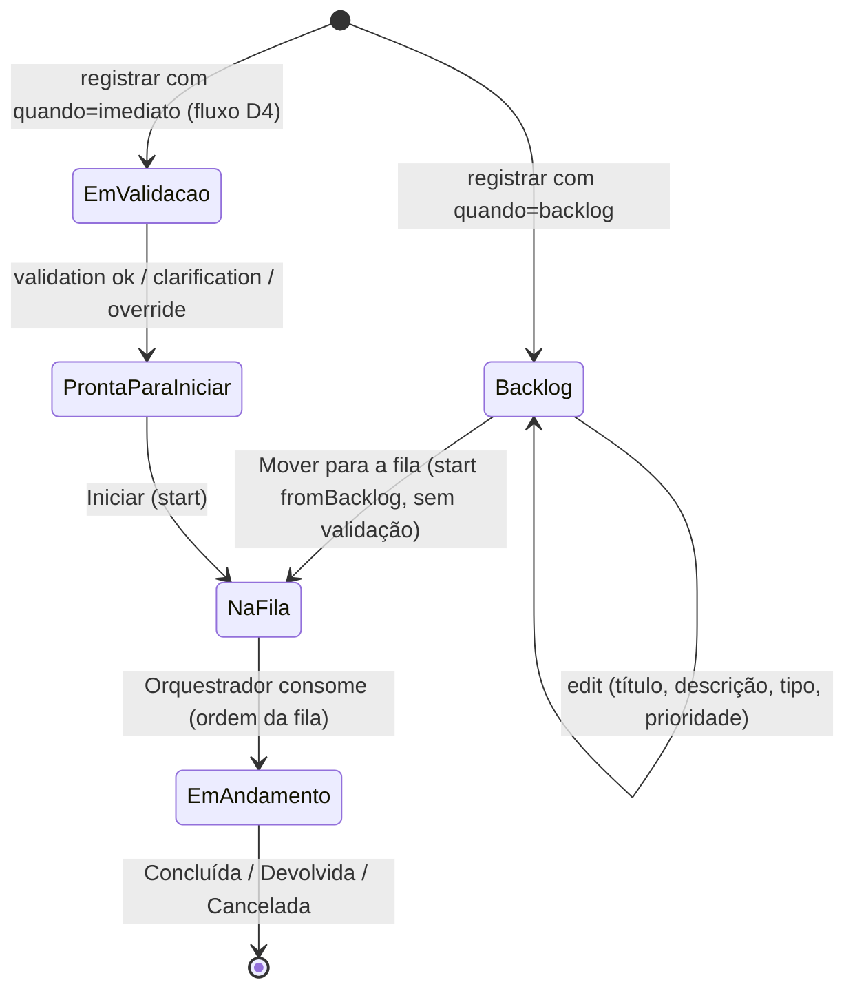

# Contrato — Backlog de demandas (D5, `d91b7a8b31d9`, tipo operação, ADR-009)

> Implementação: **Orquestrador** (`tools/squad/**`, `docs/squad/**`) e **Frontend** (`squad-control/**`).
> Base: contrato D4 [`ui-demandas-v2.md`](ui-demandas-v2.md) (tipo + validação agêntica). Critérios vêm das respostas
> do humano (evento `clarification` `ee06042cf2f9`).

## 1. Modelo

Estados de uma demanda criada pelo painel:



- **Backlog** = pré-início separado: não gera validação, não entra em `docs/squad/inbox/`, é ignorado pelo Orquestrador.
- Evento `task` ganha `"backlog": true` quando criada em backlog (ausente/false = início imediato, comportamento D4).
- A demanda está **em backlog** enquanto `task.backlog = true` e não existe `start` nem `control cancel` para ela.
- Estado efetivo (título, descrição, tipo, prioridade) = `task` + eventos `edit` aplicados em ordem de `ts`.

### Evento `edit` (autor `humano`, via servidor)
```json
{ "id": "…", "ts": "…", "agent": "humano", "type": "edit", "demand": "<id da task>", "to": "orquestrador",
  "title": "Demanda editada no backlog",
  "changes": { "title": "Backlog nas demandas", "detail": "…", "kind": "operacao", "priority": "alta" } }
```
`changes` contém só os campos alterados (`title` 1–200 chars sem prefixo "Demanda: ", `detail`, `kind` ∈
`produto|operacao`, `priority` ∈ `alta|normal|baixa`).

### Evento `start` vindo do backlog
Mesmo evento `start` atual, com `"fromBacklog": true`; o arquivo do inbox recebe o estado **efetivo** (com edições),
`fromBacklog: true` e `clarifications: []`.

## 2. Regras

1. **Quando iniciar** (campo obrigatório no formulário, rádio): `imediato` (padrão, preserva o comportamento atual)
   ou `backlog`. Rótulos: "Iniciar agora — passa pela validação do Arquiteto" / "Guardar no backlog — sem validação;
   você escolhe quando entra na fila". O formulário passa a ter **Prioridade** (alta/normal/baixa, padrão normal).
2. **Validação**: aplicada **somente** a demandas criadas para início imediato (regra D4 intacta). Demanda de backlog
   **não** é validada ao ser criada **nem** ao sair do backlog (ADR-009). "Validar com o Arquiteto" no backlog: evolução.
3. **Ordenação do backlog**: prioridade efetiva (alta > normal > baixa), depois `ts` da criação (mais antiga primeiro).
4. **Edição**: título, descrição, tipo e prioridade, **somente enquanto em backlog** (servidor retorna 409 fora dele).
5. **Sair do backlog**: botão "Mover para a fila" no item (com prioridade, rota e agente, como o "Iniciar" atual) →
   `POST /api/demand/start` → `start` com `fromBacklog: true` + arquivo no inbox.
6. **Ordem da fila**: o Orquestrador consome o inbox por **prioridade** (a do último `control reprioritize` da
   demanda, senão a do `start`), depois `startedAt` (mais antiga primeiro). Backlog nunca aparece na fila.
7. **Fora de escopo** (registrado): voltar da fila para o backlog; remover/arquivar item do backlog (o controle
   "Cancelar" existente continua valendo se já exposto); reordenação manual; validação sob demanda no backlog.

## 3. Mudanças por arquivo

| Arquivo (dono) | Mudança |
|----------------|---------|
| `tools/squad/server.py` (Orquestrador) | `POST /api/demand`: aceita `when: imediato|backlog` (padrão `imediato`; outro valor → 400) e `priority` (validar enum); grava `backlog: true` se backlog. Novo `POST /api/demand/edit {id, title?, detail?, kind?, priority?}` → `edit`; 404 demanda inexistente, 409 fora do backlog, 400 campo inválido/nenhuma mudança. `POST /api/demand/start`: se a demanda está em backlog, **pula a regra de validação D4**, grava `fromBacklog: true` e usa o estado efetivo (edições) no inbox; demais casos inalterados. Iniciar duas vezes → 409 "demanda já iniciada". |
| `tools/squad/pending.py` (Orquestrador) | (a) **Não** listar `validação:` para demandas com `backlog: true`; (b) listar `fila:` ordenado pela regra §2.6 (não por nome de arquivo), com a posição (`fila 1/3: <arquivo> · alta`). |
| `tools/squad/log.py` (Orquestrador) | `TYPES` += `edit` (para registros manuais; o painel grava via servidor). |
| `tools/squad/github_sync.py` (Orquestrador) | Issue de demanda em backlog criada com label `backlog` e Status `Backlog`; `edit` → `gh issue edit` (título/corpo) + comentário "Editada no backlog" com os campos alterados, e troca de label `tipo:*`/`prioridade:*` se mudarem; `start` com `fromBacklog` → remove label `backlog`. |
| `docs/squad/prompts/plantao.md` (Orquestrador) | Item C: "processe os itens `fila` **na ordem listada pelo `pending.py`**, um por vez; backlog é ignorado". |
| `squad-control/index.html` (Frontend) | Formulário: rádio "Quando iniciar" + seletor de prioridade. Aba Demandas: seção **Backlog (n)** ordenada (§2.3) com tipo, prioridade, "Editar" (edição inline com `label`s, Salvar/Cancelar) e "Mover para a fila"; seção **Fila** com posição (`1º na fila`) na ordem §2.6; demais demandas como hoje. Estado "Backlog" com tag própria (texto, não só cor). Tratar 400/404/409 com a mensagem do servidor. |

## 4. Critérios de aceite

| # | Critério | Verificação |
|---|----------|-------------|
| CA1 | Criar com "Guardar no backlog" grava `task` com `backlog: true`; a demanda aparece só na seção Backlog; **nenhum** `validation`/`progress` do Arquiteto é gerado e `pending.py` não a lista. | Log + `pending.py` + painel |
| CA2 | Criar com "Iniciar agora" mantém exatamente o fluxo D4 (Em validação → perguntas/ok → Iniciar). | Repetir teste D4 CA3/CA6 |
| CA3 | Backlog ordenado por prioridade (alta > normal > baixa) e, empatado, por criação mais antiga; muda de posição ao editar a prioridade. | 3 demandas com prioridades distintas |
| CA4 | Editar título/descrição/tipo/prioridade no backlog grava `edit` e o card/issue refletem o novo estado; editar demanda fora do backlog → `409` (UI não oferece a ação). | Painel + `curl /api/demand/edit` |
| CA5 | "Mover para a fila" grava `start` com `fromBacklog: true` **sem** exigir validação, cria o arquivo no inbox com o estado editado e a demanda sai do backlog; segundo start → `409`. | Log + `docs/squad/inbox/<id>.json` |
| CA6 | `pending.py` lista a fila na ordem prioridade → `startedAt`; o plantão processa nessa ordem; demandas em backlog nunca aparecem. | 3 starts fora de ordem, conferir saída |
| CA7 | Issue da demanda em backlog tem label `backlog` (removida ao mover para a fila) e recebe comentário a cada edição. | `gh issue view` |
| CA8 | Sem regressão: pausar/retomar/repriorizar/cancelar, gates, decisões humanas, demandas antigas (sem `kind`) e D4 funcionam como antes; acessibilidade (rótulos, teclado, texto além de cor) no formulário e no backlog. | Smoke das abas + teclado |

## 5. Plano de teste
1. **API** (`curl` em `server.py`): `POST /api/demand` com `when` inválido → 400; backlog → 201 com `backlog: true`;
   `edit` (200/201, 400, 404, 409); `start` de backlog sem validação → 201; repetido → 409 (CA1, CA4, CA5).
2. **pending.py**: com 1 demanda em backlog e 3 na fila (baixa, alta, normal) → sem `validação:` do backlog e fila em
   ordem alta, normal, baixa (CA1, CA6).
3. **Painel**: criar, editar, ordenar e mover (CA3, CA4); fluxo imediato D4 (CA2); acessibilidade e regressão (CA8).
4. **GitHub**: labels/comentários com `github_sync.py --watch` ativo (CA7).
Evidências: `log.py --type evidence --demand d91b7a8b31d9 --evidence "<CA>=pass|fail"`.
