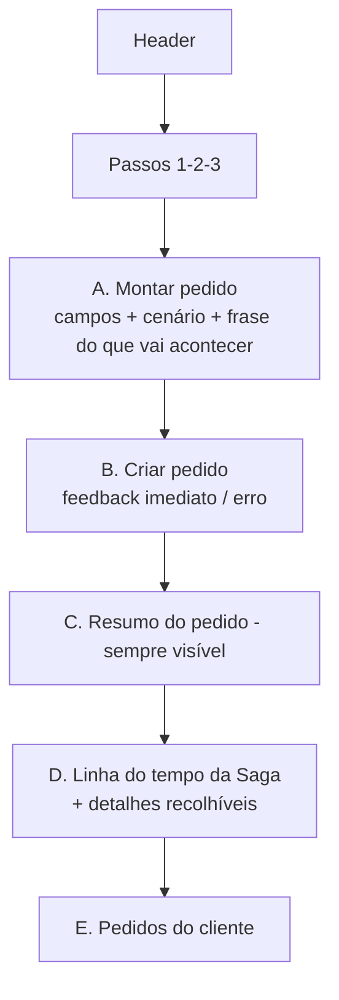

# Contrato de tela — Console de Checkout (D2, ADR-007)

> Demanda D2 (`48b6ace91207`): "Melhorar o visual do checkout — deixar mais intuitivo e fluido. Não se pode quebrar
> ou modificar regras de negócio já existentes." Dono da implementação: agente **Frontend** (`checkout-console/**`).
> Fonte de dados única: [`docs/contracts/api.md`](api.md). Base atual: `checkout-console/index.html` (servido em
> http://localhost:8090, proxy `nginx.conf` em `/api/<serviço>/`).

## 1. Objetivo, público e escopo

**Objetivo**: permitir que alguém que nunca viu o sistema crie um pedido, entenda o que vai acontecer e acompanhe a
Saga até o desfecho sem ler JSON, em uma única tela.

**Público**: (1) operador/apresentador na demo (escolhe cenários de falha, mostra compensações); (2) "cliente" que
cria o pedido e quer saber o status.

**O que NÃO muda (restrições bloqueantes)**:
- Nenhuma API nova, nenhum campo novo, nenhuma mudança em eventos, Saga, serviços ou `nginx.conf` (exceto se o
  Frontend precisar de rota de proxy já existente — hoje todas existem).
- Nenhuma regra de negócio no front: o front **não** decide status, não calcula desfecho, não "adivinha" compensação.
  Todo estado exibido vem de `GET /orders/{orderId}` (`status`, `cancellationReason`, `history[]`, `paymentId`,
  `trackingCode`), `GET /orders?customerId=`, `GET /inventory/stock/{sku}` e `GET /sagas/{sagaId}` (link de diagnóstico).
- O corpo do `POST /orders` continua idêntico ao atual (mesmos campos, mesmo endereço de demo, mesmos SKUs/preços,
  mesmos valores de `simulate`). Um novo `Idempotency-Key` (UUID) por pedido **novo**.
- Precisa de um dado que a API não expõe → `change-request` para o Arquiteto; nunca simular no front.

## 2. Mapeamento de estados da linha do tempo (regra de apresentação, derivada só de `history[]`)

Etapas exibidas, nesta ordem: **Pedido criado** (`ORDER`/`CREATED`) → **Estoque** (`INVENTORY`) → **Pagamento**
(`PAYMENT`) → **Envio** (`SHIPPING`, só se `deliveryType = PHYSICAL`) → **Desfecho** (`ORDER` `CONFIRMED`/`CANCELED`).
Estado visual de cada etapa = **último** registro de `history[]` com aquele `step` (ordenado por `at`):

| Último `status` do step | Estado visual | Texto + ícone (não só cor) |
|-------------------------|---------------|----------------------------|
| (nenhum registro) e pedido `PENDING` | Aguardando | "Aguardando" + ○ |
| (nenhum registro) e pedido terminal | Não executada | "Não executada" + – |
| `STARTED`, `RETRYING`, `TIMED_OUT` (pedido `PENDING`), `COMPENSATING` | Em andamento | "Em andamento" + ◐ (com "tentativa N" se `attempt > 1`; "compensando" se `COMPENSATING`) |
| `SUCCEEDED`, `CREATED`, `CONFIRMED` | Concluída | "Concluída" + ✓ |
| `FAILED`, `TIMED_OUT` (pedido terminal), `CANCELED` | Falhou | "Falhou" + ✕ + `detail` |
| `COMPENSATED` | Compensada | "Compensada (desfeita)" + ↺ |
| Envio em pedido `DIGITAL` | Não aplicável | "Não se aplica (entrega digital)" |

Cores (identidade adotada): concluída `--green`, falhou `--red`, em andamento/compensada `--amber`, aguardando `--dim`;
destaque de interação somente `#1F3A5F`. Um `status` desconhecido é exibido literalmente como "em andamento".

## 3. Critérios de aceite (verificáveis)

| # | Critério | Como verificar |
|---|----------|----------------|
| CA1 | **Fluxo em 3 passos visíveis**: "1 Montar pedido → 2 Enviar → 3 Acompanhar", com o passo atual destacado (`aria-current="step"`). | Inspeção + DOM |
| CA2 | **Linha do tempo da Saga** com as etapas e estados da §2; cada estado tem **texto e ícone**, não só cor; tentativas (`attempt > 1`) e compensações aparecem na etapa correspondente. Tabela detalhada de `history[]` continua disponível (recolhível). | Cenários DECLINE, FAIL, TIMEOUT_ONCE |
| CA3 | **Resumo do pedido sempre visível** durante o acompanhamento: `orderId` (8 chars + copiar completo), itens (SKU × quantidade), total em R$ (`pt-BR`), tipo de entrega, status atual e `cancellationReason` quando houver. Em desktop fica fixo (sticky) ao rolar. | Rolar a página durante um TIMEOUT |
| CA4 | **"O que vai acontecer"**: ao escolher um cenário de falha, uma frase explica o resultado esperado **antes** de enviar (ex.: DECLINE → "O pagamento será recusado; o estoque reservado será liberado e o pedido cancelado."). Uma frase para cada valor de `simulate` atual e para "nenhum". | Trocar a opção e ler |
| CA5 | **Primeiro feedback < 1 s**: ao receber o `202`, mostrar imediatamente "Pedido aceito — Saga iniciada" com o `orderId`, sem esperar o primeiro poll. Botão mostra "Enviando…" e fica desabilitado enquanto o POST está em voo (evita duplo clique). | DevTools (timeline) |
| CA6 | **Erros claros**: `400`/`409` mostram `detail` do problem+json e, se houver `errors[]`, a mensagem junto do campo (`aria-describedby`); serviço fora (falha de rede, `502/503/504` do proxy) mostra "Serviço de pedidos indisponível — tente novamente" e **reabilita** o botão. Ao repetir após falha de rede com o mesmo formulário, **reutiliza o mesmo `Idempotency-Key`**. | Parar `order-service` e enviar; enviar `quantity=0` |
| CA7 | **Carregamento**: indicador textual enquanto o pedido está `PENDING` ("Saga em andamento… atualizado há N s"); polling de `GET /orders/{id}` a cada 1 s, **para** ao atingir `CONFIRMED`/`CANCELED` e após 120 s mostra "A Saga está demorando; consulte o diagnóstico" (link `GET /sagas/{sagaId}`). | Cenário TIMEOUT |
| CA8 | **Pedidos do cliente** vêm de `GET /orders?customerId=` (ordem da API, `createdAt desc`), exibindo status (texto + cor), valor em R$, tipo de entrega, data/hora e motivo de cancelamento; lista vazia mostra "Este cliente ainda não tem pedidos."; clicar/Enter em um item abre o acompanhamento dele. Atualiza ao terminar cada saga. | Criar 2 pedidos e comparar com curl |
| CA9 | **Acessibilidade**: `<label for>` em todos os campos; foco visível (contorno 2px `#1F3A5F`) em todos os controles, inclusive itens da lista; operável só por teclado (Tab/Enter/Espaço); contraste de texto ≥ 4.5:1; região do status com `aria-live="polite"`; `lang="pt-BR"`. | Navegar sem mouse; checar contraste |
| CA10 | **Responsivo a 390 px**: coluna única sem rolagem horizontal; ordem: passos → formulário → resumo → linha do tempo → pedidos do cliente; alvos de toque ≥ 44 px. | DevTools 390×844 |
| CA11 | **Sem bibliotecas externas** além de IBM Plex Sans/Mono (Google Fonts); HTML/CSS/JS puros num único `index.html`, sem build; fallback de fonte do sistema. | `grep -E '<script src|\.js"' index.html` vazio |
| CA12 | **Regras preservadas**: corpo do `POST /orders` byte a byte equivalente ao atual para as mesmas escolhas (mesmos campos, SKUs, preços, endereço, `simulate`); nenhuma chamada a endpoint fora de `api.md`; bloco "Equivalente em curl" mantido (recolhível). | Comparar payload no DevTools antes/depois |

## 4. Estrutura da tela

```
Desktop (≥ 900 px)                                           
┌──────────────────────────────────────────────────────────────────────────────┐
│ Header: logo · "Checkout Saga" · "Console de pedidos"      (faixa do desafio) │
├──────────────────────────────────────────────────────────────────────────────┤
│ Passos:  [1 Montar pedido] ── [2 Enviar] ── [3 Acompanhar]                   │
├──────────────────────────────┬───────────────────────────────────────────────┤
│ A. Montar pedido             │ C. Resumo do pedido (sticky)                  │
│   Cliente                    │   orderId · status · motivo                   │
│   Produto · Quantidade       │   itens · total · entrega · rastreio          │
│   Estoque disponível (hint)  ├───────────────────────────────────────────────┤
│   Entrega                    │ D. Linha do tempo da Saga                     │
│   Cenário + "o que vai       │   ✓ Pedido criado                             │
│   acontecer" (1 frase)       │   ✓ Estoque        ◐ Pagamento (tentativa 2)  │
│ B. [ Criar pedido ]          │   ○ Envio          ○ Desfecho                 │
│   erro/feedback inline       │   ▸ Detalhes (tabela history) ▸ curl ▸ links  │
├──────────────────────────────┴───────────────────────────────────────────────┤
│ E. Pedidos do cliente c-demo (GET /orders?customerId=)                        │
└──────────────────────────────────────────────────────────────────────────────┘
```


Ordem de leitura/tabulação = A → B → C → D → E (idem no layout de 390 px, empilhado). Antes do primeiro pedido, C/D
mostram um estado vazio explicativo ("Crie um pedido para acompanhar a Saga aqui").

## 5. O que o QA deve testar

**Smoke (automatizável)**:
1. `curl -s -o /dev/null -w '%{http_code}' localhost:8090/` → `200`; `curl -s localhost:8090/api/order/orders?customerId=c-demo` → array JSON.
2. `grep` no `index.html`: nenhum `<script src=`, nenhum host além de `fonts.googleapis.com`/`fonts.gstatic.com`;
   todas as URLs chamadas começam com `/api/{order,saga,inventory}/` e mapeiam para endpoints de `api.md`.
3. Criar pedido pela página (caminho feliz) e conferir com `curl localhost:8081/orders/{id}` → mesmo status.

**Checklist manual de UI** (registrar como evidência `--type evidence --demand 48b6ace91207`):
- [ ] CA1–CA5 no caminho feliz `PHYSICAL` e `DIGITAL` (envio "não se aplica").
- [ ] `payment=DECLINE`: Pagamento "Falhou", Estoque "Compensada", Desfecho cancelado com motivo.
- [ ] `shipping=FAIL`: Envio "Falhou", Pagamento e Estoque "Compensada".
- [ ] `payment=TIMEOUT_ONCE`: Pagamento mostra "tentativa 2" e depois "Concluída".
- [ ] `payment=TIMEOUT`: resumo permanece visível durante ~20 s; polling para no terminal.
- [ ] `order-service` parado: mensagem de indisponibilidade, botão reabilitado; `quantity=0` → 400 com mensagem no campo.
- [ ] Teclado apenas, 390 px, contraste (CA9, CA10).
- [ ] Payload do `POST /orders` igual ao da versão anterior (CA12).
