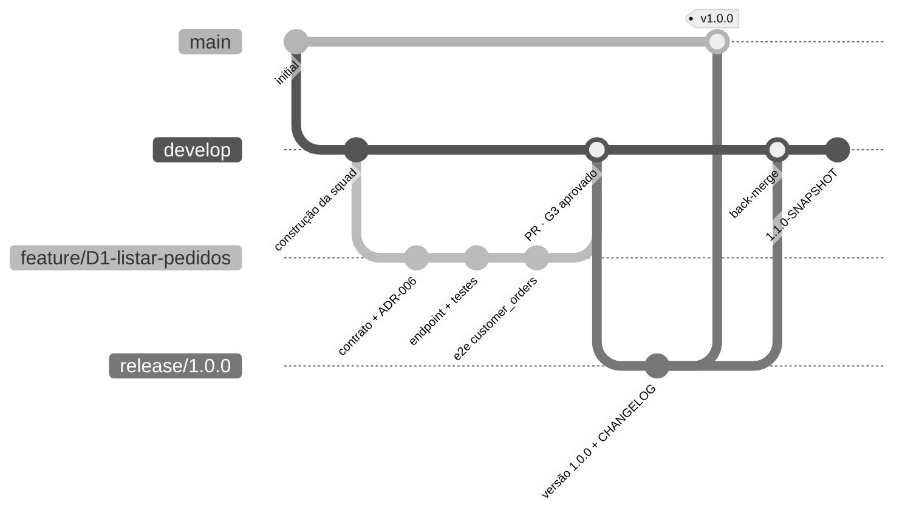

# Git Flow da squad

## Como uma demanda vira código em produção

| Momento | Comando | Guarda |
|---|---|---|
| Orquestrador inicia a demanda | `gitflow.py feature-start D3 cupom-desconto --demand <id>` | parte sempre da `develop` atualizada |
| Cada passo do protocolo | commits na feature (contrato, implementação, testes) | commits pequenos e rastreáveis |
| Auditor aprova o G3 | `gitflow.py feature-finish --demand <id>` | **sem G3 APPROVE, o merge é bloqueado** |
| Humano decide publicar | `gitflow.py release-start 1.1.0` | versão do pom + CHANGELOG gerado do log |
| Release aprovada | `gitflow.py release-finish 1.1.0` | PR para `main`, tag `v1.1.0`, GitHub Release, back-merge e próxima `-SNAPSHOT` |
| Urgência em produção | `gitflow.py hotfix-start 1.0.1 <slug>` → `hotfix-finish 1.0.1` | parte da `main`; volta para `main` e `develop` |

As demandas D1 e D2 foram entregues antes da adoção do Git Flow (tudo numa única branch de trabalho), e estão
contidas na release 1.0.0. A partir da 1.0.0, toda demanda segue o fluxo acima.
