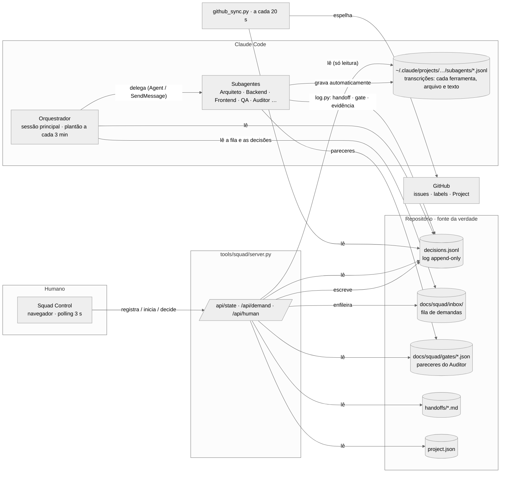

# Como o Squad Control monitora a squad

Não existe banco de dados. O estado da squad vive em **arquivos**: o log de eventos no repositório (versionado, auditável)
e as transcrições que o próprio Claude Code grava para cada agente. O painel só **lê** esses arquivos e deriva o que mostra.

## O que cada fonte responde

| Pergunta do painel | De onde vem | Regra |
|---|---|---|
| Que demandas existem e em que estado? | `decisions.jsonl` | `task` do humano = registrada; `start` = iniciada; eventos de agentes com `demand` = em andamento; gate G3 APPROVE = concluída; `control` = pausada/cancelada |
| Quem está trabalhando **agora**? | transcrições `agent-*.jsonl` | arquivo alterado nos últimos 45 s **ou** última ação é uma ferramenta ainda sem resultado = trabalhando |
| O que o agente está fazendo? | transcrições | cada `tool_use` (Bash, Write, Edit, Read…) com seu resumo; a ação sem `tool_result` é a **em execução** |
| Quando terminou? | sessão principal + transcrição | notificação de término na sessão do Orquestrador, ou turno encerrado há > 90 s |
| Qual a recomendação e a confiança? | `docs/squad/gates/*.json` + evento `gate` | confiança = Σ pesos cumpridos / Σ pesos (`docs/squad/gates.md`) |
| O humano precisa intervir? | evento `gate` | confiança < 70 %, risco alto ou 3.º ciclo → obrigatória |
| O que o humano decidiu? | evento `human` (por gate **e** por demanda) | o plantão do Orquestrador executa a decisão no próximo ciclo |

## Por que arquivos, e não um banco
- **Auditoria**: cada evento tem id, hora, agente e fica no git — a evidência pedida pelo desafio nasce pronta.
- **Independência de fornecedor**: qualquer agente (Claude Code, Copilot, Devin) que leia e escreva os mesmos arquivos
  participa do mesmo protocolo.
- **Sem estado escondido**: o painel não guarda nada; se cair, basta reabrir.
- **Evolução**: para várias squads e histórico longo, o log pode ser enviado a um banco/stream (ex.: Kafka + Postgres)
  sem mudar o protocolo dos agentes.
